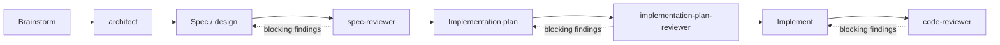

# Claude Harness


A curated, self-maintaining [Claude Code](https://claude.com/claude-code) configuration for agentic, spec-driven development — engineered rather than accreted: an audited, evidence-based selection of agents, rules, and skills instead of a pile of installed plugins. What that produced: reviewer subagents that gate every phase, model routing that spends the right model tier on the right task, and the maintenance skills that keep the whole setup aligned with Claude Code as it evolves.

This is not an application — there is nothing to build or run to use the repo. It is a reference configuration you copy into your `~/.claude` directory, plus the meta-prompts that were used to design and audit it, so you can adapt the same methodology to your own harness. It is aimed at people already using Claude Code who want reviewer-gated phases and deliberate model routing without assembling them piece by piece — copy what you need, skip the rest.

## Why

Five ideas shape everything in this repo:

1. **Harness engineering over accretion.** The configuration was designed by an explicit audit — inventory, evidence dossiers per skill, weighted comparison per workflow phase, a conflict matrix, a target harness, and a migration plan — not by installing popular plugins until something worked. Every claim about a skill derives from the files actually on disk, never from training memory. The methodology is [`HarnessConfiguration/prompts/5_AnalyzeSkills.md`](HarnessConfiguration/prompts/5_AnalyzeSkills.md).
2. **Thin skills, thick context.** A skill earns its place by what it loads per unit of value: lean body at invocation, depth in reference files loaded on demand, no imperative directives that burn context every turn. The thickness lives in the artifact chain — spec, plan, cross-referenced tasks, review reports — and in `CLAUDE.md` precedence rules. For some phases the winning choice is zero skills and one line of instruction.
3. **Spec-driven workflow with quality gates.** Work moves through a pipeline — design, spec, plan, implementation — and a dedicated reviewer subagent critiques the output of each phase *before* the next one starts. Nothing gets planned from an unreviewed spec, and nothing gets merged from an unreviewed plan.
4. **Deliberate model routing.** Everyday work runs at the default tier; the expensive, highest-tier models are reserved for the phases where judgement actually pays: architecture, spec review, plan review, and code review. Model references are aliases only (`fable`, `opus`, `sonnet`, `haiku`) — never versioned IDs — with a tiered fallback chain, so the configuration survives model updates. The full set of requirements is in [`HarnessConfiguration/prompts/2_ImproveClaudeCodeConfiguration.md`](HarnessConfiguration/prompts/2_ImproveClaudeCodeConfiguration.md).
5. **The harness maintains itself.** Two skills keep the configuration honest: one re-validates model routing against the current official docs, and one re-vendors a fleet of vendored skills from their upstream plugins without losing protected local edits.

## The workflow



Each reviewer gates the phase after it: blocking findings send work back one step instead of forward into code.

## What's inside

```
HarnessConfiguration/
├── config/
│   ├── agents/     # 4 subagents forming the review pipeline
│   ├── rules/      # 1 global rule (effort escalation)
│   └── skills/     # 2 maintenance skills (skills-resync ships scripts/: resync.sh, inventory.tsv, patches/)
└── prompts/        # 5 meta-prompts that designed and audited this config
```

### Subagents (`config/agents/`)

| Agent | Model | Role |
|---|---|---|
| `architect` | `fable` | Designs the architecture before any plan is written: grounds it in the real codebase, names rejected alternatives and their trade-offs, covers security and failure modes, proposes a build sequence |
| `spec-reviewer` | `opus` | Reviews design specs and RFCs for correctness, architecture, security, and maintainability; returns blocking issues first |
| `implementation-plan-reviewer` | `opus` | Reviews coding plans against the actual codebase: step ordering, completeness, risk of irreversible steps |
| `code-reviewer` | `opus` | Reviews the diff at the end of implementation: logic errors, security, needless complexity, severity-first with `file:line` |

### Rules (`config/rules/`)

- **`effort-escalation.md`** — stay at the default reasoning effort; recommend raising it only for deep multi-file debugging, architecture decisions with real trade-offs, security-critical review, or a final verification pass. Bulk exploration delegated to subagents uses `haiku`.

### Skills (`config/skills/`)

| Skill | Purpose |
|---|---|
| `model-config-sync` | Re-validates the model-routing configuration (aliases, fallback chain, advisor, subagent frontmatter) against the current official Claude Code docs and proposes diffs — never auto-applies them |
| `skills-resync` | Re-syncs ~28 vendored skills in `~/.claude/skills` against their upstream plugins, replaying protected local edits across each re-vendor (see below) |

### Prompts (`prompts/`)

The meta-prompts that produced and audited this configuration — usable as a methodology for your own setup:

1. `1_WriteClaudeCodeConfigurationImprovementPrompt.txt` — the original request that started the chain
2. `2_ImproveClaudeCodeConfiguration.md` — the requirements spec (R1–R10) behind the model-routing strategy
3. `3_WriteClaudeCodeHarnessImprovementPrompt.txt` — request for a whole-harness audit prompt
4. `4_ImproveClaudeCodeHarness.md` — two-phase audit/alignment prompt for an entire `~/.claude`
5. `5_AnalyzeSkills.md` — a five-phase harness redesign methodology: inventory → evidence dossiers → weighted comparison → conflict matrix → target harness and migration plan

## Getting started

No build step. Copy the pieces you want into your Claude Code user directory:

```bash
# agents (the review pipeline)
cp -r HarnessConfiguration/config/agents/* ~/.claude/agents/

# skills (the maintenance tooling)
cp -r HarnessConfiguration/config/skills/* ~/.claude/skills/

# the global rule
cp HarnessConfiguration/config/rules/effort-escalation.md ~/.claude/rules/
```

Then reference the rule from your `~/.claude/CLAUDE.md` so it loads in every session. Restart Claude Code (or start a new session) and the subagents are available to the planner and to you by name.

## The `skills-resync` engine

Vendored skills (copied out of plugins so they survive plugin updates) receive no marketplace updates. [`skills-resync`](HarnessConfiguration/config/skills/skills-resync/SKILL.md) makes re-vendoring mechanical: it resolves the upstream copy from the marketplace clone, classifies drift, snapshots local edits as replayable patches, and performs verify-then-swap re-vendors with automatic rollback if a patch rejects.

```bash
bash scripts/resync.sh --refresh            # pull marketplaces, mirror url-pinned plugins
bash scripts/resync.sh --check              # classify every vendored skill's drift
bash scripts/resync.sh --diff <skill>       # show local vs upstream for one skill
bash scripts/resync.sh --snapshot <skill>   # regenerate the protected-edits patch
bash scripts/resync.sh --apply <skill>      # re-vendor and replay local edits
bash scripts/resync.sh --hash <dir>         # print the tree hash of a skill directory
bash scripts/resync.sh --clean [--dry-run]  # remove orphaned skills and leftovers
bash scripts/resync.sh --self-test          # run the engine's self-test in a scratch dir
```

All paths default to `~/.claude` and can be overridden through environment variables: `SKILLS_DIR`, `PLUGINS_JSON`, `PLUGIN_CACHE`, `MARKETPLACES`, `MIRRORS`, `ORPHAN_MIN_AGE`.

Run `--self-test` first on a new machine — it exercises replace, patch replay, reject-rollback, and baseline rebase in a throwaway directory.

## Compatibility

- **Windows first**: developed and used on Windows with Git Bash — CRLF-tolerant, `cygpath`-aware, notes on MSYS argument mangling. Works on Unix/macOS Git Bash too.
- **Requires**: `git`, `patch`, `diff`, `awk`, and `python3` (or `python`) on PATH. The `claude` CLI is optional, for `--refresh`.
- **Claude Code features in use**: model aliases in subagent frontmatter, `fallbackModel` / `advisorModel` settings, `disable-model-invocation` on manual skills. The configuration targets current Claude Code releases; `model-config-sync` exists to catch drift when they change.

## License

[Apache License 2.0](LICENSE)
