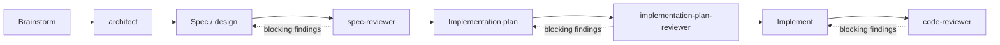

# Claude Harness


A curated, self-maintaining [Claude Code](https://claude.com/claude-code) configuration for spec-driven development — built by an explicit audit instead of accumulated plugin installs. What that produced: reviewer subagents that gate every phase, model routing that spends the right model tier on the right task, and two maintenance skills that keep the whole setup aligned with Claude Code as it evolves.

This is not an application. There is nothing to build or run. It is a reference configuration you copy into your `~/.claude` directory, plus the meta-prompts that were used to design and audit it — so you can apply the same method to your own setup. It is written for people who already use Claude Code and want reviewer-gated phases and deliberate model routing, without assembling them piece by piece. Copy what you need, skip the rest.

## Key terms

The README uses these words with a specific meaning. They are all standard Claude Code vocabulary:

| Term | Meaning |
|---|---|
| **harness** | The whole setup around the model: subagents, rules, skills, and settings. This repo is a harness. |
| **skill** | A folder with a `SKILL.md` file that teaches Claude Code one specific job. |
| **subagent** | A helper agent with its own context window, its own model, and its own tools. You start it by name, it does one job, and it reports back. |
| **rule** | A small instruction file that is loaded in every session, so it shapes every turn. |
| **context window** | Everything the model can see in one turn. It is shared, limited, and every installed skill sits in it. |
| **vendored skill** | A skill copied out of its plugin into your own `skills/` folder, so no plugin update can change or remove it. |

## The five ideas behind it

1. **Designed, not accumulated.** Most setups grow by installing popular plugins until something works. This one was designed by an explicit audit: an inventory of everything installed, an evidence report for each skill, a weighted comparison of candidates per workflow phase, a conflict matrix, a target setup, and a migration plan. Every claim about a skill comes from the file on disk, never from training memory. The full method is a prompt you can run yourself: [`prompts/5_AnalyzeSkills.md`](prompts/5_AnalyzeSkills.md).
2. **Thin skills, thick context.** A skill earns its place by what it loads per unit of value. Every installed skill sits in the context window in *every* turn, and every subagent inherits that weight — so: few skills, small ones, and know what each one does. The real knowledge should grow step by step in the documents the workflow produces (spec, plan, tasks, review reports), not be loaded up front by a big skill. For some phases, the winning choice is zero skills and one line of instruction.
3. **A review gate on every phase.** Work moves through a pipeline — design, spec, plan, implementation — and a dedicated reviewer subagent checks the output of each phase *before* the next one starts. Nothing gets planned from an unreviewed spec, and nothing gets merged from an unreviewed plan.
4. **Model routing on purpose.** Everyday work runs at the default tier. The strongest, most expensive models are reserved for the phases where judgement actually pays: architecture, spec review, plan review, and code review. All model references are aliases (`fable`, `opus`, `sonnet`, `haiku`) — never versioned IDs — with a tiered fallback chain, so the configuration survives model updates. The full requirement set is in [`prompts/2_ImproveClaudeCodeConfiguration.md`](prompts/2_ImproveClaudeCodeConfiguration.md).
5. **The harness maintains itself.** Two manual skills keep the configuration honest. `model-config-sync` re-checks the model routing against the current official docs. `skills-resync` re-vendors a fleet of vendored skills from their upstream plugins without losing protected local edits.

## The workflow



How to read it:

- `architect` produces a design grounded in the real codebase.
- `spec-reviewer` checks the spec written from that design. Blocking findings send work back to the spec, not forward.
- `implementation-plan-reviewer` checks the plan written from the spec, against the actual files it names.
- `code-reviewer` checks the final diff before anything merges.

Each reviewer gates the phase after it: a blocking finding sends work back one step instead of forward into the code.

## What's inside

The repo root mirrors the `~/.claude` destinations, so copy commands and the release zip share its shape:

```
├── agents/              # 4 subagents forming the review pipeline
├── rules/               # 1 global rule (effort escalation)
├── skills/              # 2 maintenance skills (skills-resync ships scripts/: resync.sh, inventory.tsv, patches/)
├── prompts/             # 5 meta-prompts that designed and audited this config
├── build_release.py     # validates the tree, builds dist/claude-harness-<version>.zip
└── .github/workflows/   # validate (every push) and release (on v* tags)
```

### Subagents (`agents/`)

| Agent | Model | What it does |
|---|---|---|
| `architect` | `fable` | Designs the architecture before any plan is written. It reads the real codebase first, then proposes component boundaries, data flow, and where new code should land. It must name one or two rejected alternatives with their trade-offs, cover security and failure modes, and end with a build order. |
| `spec-reviewer` | `opus` | Reviews design specs and RFCs for correctness, architecture, security, and maintainability. Returns blocking issues first, each with a concrete fix. |
| `implementation-plan-reviewer` | `opus` | Reviews coding plans against the actual codebase: do the files and functions in each step exist, is the order safe, what is missing (tests, config, rollback). |
| `code-reviewer` | `opus` | Reviews the diff at the end of implementation: logic errors, security, needless complexity. Findings come most severe first, each with a `file:line` reference. |

All four refer to models by alias, never by version number.

### Rules (`rules/`)

- **`effort-escalation.md`** (11 lines) — keeps reasoning effort at the default level. Claude may only *suggest* raising it, for deep multi-file debugging, an architecture decision with real trade-offs, a security-critical review, or a final verification pass — and then it waits for the user's confirmation. Bulk exploration delegated to subagents uses the `haiku` tier.

### Skills (`skills/`)

| Skill | Purpose |
|---|---|
| `model-config-sync` | Re-validates the model-routing configuration (aliases, fallback chain, advisor, subagent frontmatter) against the current official Claude Code docs, then proposes diffs — it never applies an edit without confirmation. |
| `skills-resync` | Re-syncs ~28 vendored skills in `~/.claude/skills` against their upstream plugins, replaying protected local edits across each re-vendor (details below). |

Both skills are manual: their frontmatter says `disable-model-invocation: true`, so they never fire on their own. You call them by name when you want them.

One caveat when adopting `skills-resync`: `scripts/inventory.tsv` and `scripts/patches/` ship the author's own vendored fleet as a worked example of the format, not configuration to reproduce. The engine itself is generic, and every path it touches is overridable through environment variables (`INVENTORY`, `SKILLS_DIR`, `PLUGINS_JSON`, …).

### Prompts (`prompts/`)

The meta-prompts that produced and audited this configuration. Read in order, they reconstruct every decision. Run against your own `~/.claude`, they produce a setup that fits *your* workflow:

1. `1_WriteClaudeCodeConfigurationImprovementPrompt.md` — the original request that started the chain.
2. `2_ImproveClaudeCodeConfiguration.md` — the requirements spec (R1–R10) behind the model-routing strategy.
3. `3_WriteClaudeCodeHarnessImprovementPrompt.md` — request for a whole-harness audit prompt.
4. `4_ImproveClaudeCodeHarness.md` — a two-phase audit/alignment prompt for an entire `~/.claude`.
5. `5_AnalyzeSkills.md` — the five-phase harness redesign method: inventory → evidence dossiers → weighted comparison → conflict matrix → target harness and migration plan.

## Getting started

No build step. Pick one of the two install paths below.

### What you need

- [Claude Code](https://claude.com/claude-code) installed and working.
- Only if you adopt `skills-resync`: a Git Bash shell with `git`, `patch`, `diff`, `awk`, and `python3` (or `python`) on PATH. The `claude` CLI is optional, used by `--refresh`.

### Option 1 — copy from a clone

```bash
git clone https://github.com/StefanoZaghi1987/ClaudeHarness.git
cd ClaudeHarness

# agents (the review pipeline)
cp -r agents/* ~/.claude/agents/

# skills (the maintenance tooling)
cp -r skills/* ~/.claude/skills/

# the global rule
cp rules/effort-escalation.md ~/.claude/rules/
```

Take only the pieces you want — a single agent works without the others, although the pipeline is designed to run as a chain.

### Option 2 — install a release zip

Replace `v1.0.0` with the [latest tag](https://github.com/StefanoZaghi1987/ClaudeHarness/releases). The zip contains `agents/`, `skills/`, `rules/` at the top level, so it expands straight into `~/.claude/` and overwrites files with the same names:

```bash
curl -fsSL -o /tmp/claude-harness.zip \
  https://github.com/StefanoZaghi1987/ClaudeHarness/releases/download/v1.0.0/claude-harness-v1.0.0.zip
unzip -o /tmp/claude-harness.zip -d ~/.claude/
```

```powershell
Invoke-WebRequest https://github.com/StefanoZaghi1987/ClaudeHarness/releases/download/v1.0.0/claude-harness-v1.0.0.zip -OutFile $env:TEMP\claude-harness.zip
Expand-Archive $env:TEMP\claude-harness.zip -DestinationPath $HOME\.claude -Force
```

### Finish the setup

Reference the rule from your `~/.claude/CLAUDE.md` so it loads in every session, for example:

```markdown
@~/.claude/rules/effort-escalation.md
```

Then restart Claude Code (or start a new session). The subagents are now available — to the planner and to you — by name.

If you adopted `skills-resync`, run its self-test once before anything else (see below).

## The `skills-resync` engine

Vendored skills receive no marketplace updates — that is the price of surviving plugin sweeps. [`skills-resync`](skills/skills-resync/SKILL.md) makes updating them mechanical again: it resolves the upstream copy from the marketplace clone, classifies the drift, snapshots local edits as replayable patches, and performs verify-then-swap re-vendors with automatic rollback when a patch rejects.

```bash
bash scripts/resync.sh --refresh            # pull marketplaces, mirror url-pinned plugins
bash scripts/resync.sh --check              # classify every vendored skill's drift
bash scripts/resync.sh --diff <skill>       # show local vs upstream for one skill
bash scripts/resync.sh --snapshot <skill>   # regenerate the protected-edits patch
bash scripts/resync.sh --apply <skill>      # re-vendor and replay local edits
bash scripts/resync.sh --hash <dir>         # print the tree hash of a skill directory
bash scripts/resync.sh --clean [--dry-run]  # remove orphaned skills and leftovers
bash scripts/resync.sh --self-test          # run the engine's self-test in a scratch dir
```

Run `--self-test` first on a new machine — it exercises replace, patch replay, reject-rollback, and baseline rebase in a throwaway directory, without touching your real setup.

All paths default to `~/.claude` and can be overridden through environment variables: `SKILLS_DIR`, `PLUGINS_JSON`, `PLUGIN_CACHE`, `MARKETPLACES`, `MIRRORS`, `ORPHAN_MIN_AGE`.

## Compatibility

**This configuration is Claude Code only.** Both skills manage the local Claude Code installation — the `~/.claude` filesystem and a bash toolchain — which claude.ai cannot reach, whatever the packaging. Each `SKILL.md` declares this in its `compatibility` frontmatter field (the Agent Skills spec's free-text field for stating environment requirements). For skills that also run on claude.ai, see [ClaudeSkills](https://github.com/StefanoZaghi1987/ClaudeSkills).

- **Windows first**: developed and used on Windows with Git Bash — CRLF-tolerant, `cygpath`-aware, with notes on MSYS argument mangling. Works on Unix/macOS Git Bash too.
- **Requires**: `git`, `patch`, `diff`, `awk`, and `python3` (or `python`) on PATH. The `claude` CLI is optional, for `--refresh`.
- **Claude Code features in use**: model aliases in subagent frontmatter, `fallbackModel` / `advisorModel` settings, `disable-model-invocation` on manual skills. The configuration targets current Claude Code releases; `model-config-sync` exists to catch drift when they change.

## Building and releases

`python build_release.py [version]` validates the tree — every skill has a `SKILL.md`, the frontmatter `name` matches its directory, the name fits the official charset without reserved words, and `description` and `compatibility` are present — then zips `agents/`, `skills/`, `rules/` into `dist/claude-harness-<version>.zip`. Two workflows use it: `validate` runs the build plus `resync.sh --self-test` on every push, and `release` attaches the zip to a GitHub Release on `v*` tags. The first release is `v1.0.0`.

## License

[Apache License 2.0](LICENSE)
