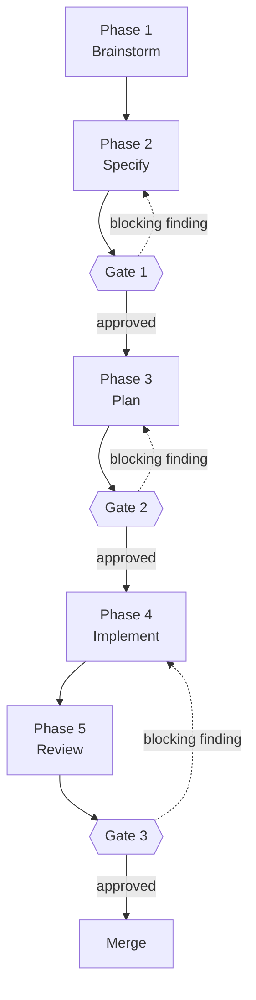

# Claude Harness


A curated, self-maintaining [Claude Code](https://claude.com/claude-code) configuration for spec-driven development — built by an explicit audit instead of accumulated plugin installs. What that produced: a written workflow of five phases and three approval gates, reviewer subagents that run the automated half of each gate, model routing that spends the right model tier on the right task, and two maintenance skills that keep the whole setup aligned with Claude Code as it evolves.

This is not an application. There is nothing to build or run. It is a reference configuration you copy into your `~/.claude` directory, plus the meta-prompts that were used to design and audit it — so you can apply the same method to your own setup. It is written for people who already use Claude Code and want reviewer-gated phases and deliberate model routing, without assembling them piece by piece. Copy what you need, skip the rest.

## Where to go next

| If you want to… | Read |
|---|---|
| understand how work actually moves — the phases, the gates, and which tool implements each one | **[WORKFLOW.md](WORKFLOW.md)** |
| know what each reviewer subagent checks and which gate it runs | [agents/README.md](agents/README.md) |
| see the whole skill fleet, where each skill comes from, and what was deliberately left out | [skills/README.md](skills/README.md) |
| keep vendored skills up to date without their plugins | [skills/skills-resync/SKILL.md](skills/skills-resync/SKILL.md) |
| just install it | [Getting started](#getting-started) |

## Key terms

The README uses these words with a specific meaning. They are all standard Claude Code vocabulary:

| Term | Meaning |
|---|---|
| **harness** | The whole setup around the model: subagents, rules, skills, and settings. This repo is a harness. |
| **skill** | A folder with a `SKILL.md` file that teaches Claude Code one specific job. |
| **subagent** | A helper agent with its own context window, its own model, and its own tools. You start it by name, it does one job, and it reports back. |
| **rule** | A small instruction file that is loaded in every session, so it shapes every turn. |
| **context window** | Everything the model can see in one turn. It is shared, limited, and every installed skill sits in it. |
| **vendored skill** | A skill copied out of its plugin into your own `skills/` folder, so no plugin update can change or remove it. |
| **phase** | A durable step in the work. It has a goal, produces an artifact, and ends at a stated exit criterion. Phases rarely change. |
| **gate** | The end of a phase: an agent review, followed by a human approval. Work moves forward only through a gate. |

## The five ideas behind it

1. **Designed, not accumulated.** Most setups grow by installing popular plugins until something works. This one was designed by an explicit audit: an inventory of everything installed, an evidence report for each skill, a weighted comparison of candidates per workflow phase, a conflict matrix, a target setup, and a migration plan. Every claim about a skill comes from the file on disk, never from training memory. The full method is a prompt you can run yourself: [`prompts/5_AnalyzeSkills.md`](prompts/5_AnalyzeSkills.md).
2. **Thin skills, thick context.** A skill earns its place by what it loads per unit of value. Every installed skill sits in the context window in *every* turn, and every subagent inherits that weight — so: few skills, small ones, and know what each one does. The real knowledge should grow step by step in the documents the workflow produces (spec, plan, tasks, review reports), not be loaded up front by a big skill. For some phases, the winning choice is zero skills and one line of instruction.
3. **Phases are durable, tools are not.** Work moves through five phases — brainstorm, specify, plan, implement, review — and each phase is defined by the artifact it produces and the exit criterion it ends at, never by the tool that happens to implement it. Several tools can implement the same phase, and swapping one changes nothing about the workflow. What ends every phase is a **gate**, and a gate is two reviews in sequence: a reviewer subagent with a fresh context window, and then a human approval. Neither replaces the other. An agent can tell you that a spec contradicts itself; it cannot tell you that the feature is not worth building. The full pipeline is in [`WORKFLOW.md`](WORKFLOW.md).
4. **Model routing on purpose.** Everyday work runs at the default tier. The strongest, most expensive models are reserved for the phases where judgement actually pays: architecture, spec review, plan review, and code review. All model references are aliases (`fable`, `opus`, `sonnet`, `haiku`) — never versioned IDs — with a tiered fallback chain, so the configuration survives model updates. The full requirement set is in [`prompts/2_ImproveClaudeCodeConfiguration.md`](prompts/2_ImproveClaudeCodeConfiguration.md).
5. **The harness maintains itself.** Two manual skills keep the configuration honest. `model-config-sync` re-checks the model routing against the current official docs. `skills-resync` re-vendors a fleet of vendored skills from their upstream plugins without losing protected local edits.

## The workflow

Five phases, three gates. The diagram carries phase names only — which tool implements each phase is a separate, changeable decision.



Every gate is two reviews in sequence, and a blocking finding sends the work back one phase instead of forward:

| Gate | After phase | Automated check | Your decision |
|---|---|---|---|
| **Gate 1** | Specify | `spec-reviewer` reads the spec against the real codebase | Approve the spec, or send it back |
| **Gate 2** | Plan | `implementation-plan-reviewer` opens every file the plan names | Approve the plan, or send it back |
| **Gate 3** | Review | `code-reviewer` reads the diff | Approve the merge, or send the code back |

Each phase can be implemented in more than one way. Brainstorming, for example, runs on `interview-me`, `idea-refine`, `grilling` or `brainstorming` depending on how clear the idea already is — and none of those is a subagent. **[WORKFLOW.md](WORKFLOW.md)** gives every phase its goal, its exit criterion, the tools that can implement it, the bug-fixing lane, and a cheatsheet.

## What's inside

The repo root mirrors the `~/.claude` destinations, so copy commands and the release zip share its shape:

```
├── WORKFLOW.md          # the phases, the gates, and the tools that implement each one
├── agents/              # 4 subagents that run the review half of each gate
├── rules/               # 1 global rule (effort escalation)
├── skills/              # 2 maintenance skills (skills-resync ships scripts/: resync.sh, inventory.tsv, patches/)
├── prompts/             # 5 meta-prompts that designed and audited this config
├── build_release.py     # validates the tree, builds dist/claude-harness-<version>.zip
└── .github/workflows/   # validate (every push) and release (on v* tags)
```

### Subagents (`agents/`)

| Agent | Model | Runs | What it does |
|---|---|---|---|
| `architect` | `fable` | — | Designs the architecture before any plan is written. Reads the real codebase first, then proposes component boundaries, data flow, and where new code should land. Must name one or two rejected alternatives with their trade-offs. |
| `spec-reviewer` | `opus` | Gate 1 | Reviews design specs and RFCs for correctness, architecture, security, and maintainability. Blocking issues first, each with a concrete fix. |
| `implementation-plan-reviewer` | `opus` | Gate 2 | Reviews coding plans against the actual codebase: do the files and functions in each step exist, is the order safe, what is missing (tests, config, rollback). |
| `code-reviewer` | `opus` | Gate 3 | Reviews the diff at the end of implementation: logic errors, security, needless complexity. Findings most severe first, each with a `file:line` reference. |

All four refer to models by alias, never by version number. `architect` is the only generative one, and the only one on the top tier; the three reviewers are read-only except `code-reviewer`, which carries `Bash` so it can source its own `git diff`.

Full detail — the review axes of each agent, the output contract they share, and why the models are split this way — is in **[agents/README.md](agents/README.md)**.

### Rules (`rules/`)

- **`effort-escalation.md`** (11 lines) — keeps reasoning effort at the default level. Claude may only *suggest* raising it, for deep multi-file debugging, an architecture decision with real trade-offs, a security-critical review, or a final verification pass — and then it waits for the user's confirmation. Bulk exploration delegated to subagents uses the `haiku` tier.

### Skills (`skills/`)

| Skill | Purpose |
|---|---|
| `model-config-sync` | Re-validates the model-routing configuration (aliases, fallback chain, advisor, subagent frontmatter) against the current official Claude Code docs, then proposes diffs — it never applies an edit without confirmation. |
| `skills-resync` | Re-syncs ~28 vendored skills in `~/.claude/skills` against their upstream plugins, replaying protected local edits across each re-vendor (details below). |

Both skills are manual: their frontmatter says `disable-model-invocation: true`, so they never fire on their own. You call them by name when you want them.

These two **maintain** the setup. The skills that **do the work** — `interview-me`, `spec-driven-development`, `writing-plans`, `incremental-implementation` and around two dozen more — do not ship here. They come from six plugins and are vendored into `~/.claude/skills`, which is exactly why `skills-resync` exists.

One caveat when adopting `skills-resync`: `scripts/inventory.tsv` and `scripts/patches/` ship the author's own vendored fleet as a worked example of the format, not configuration to reproduce. The engine itself is generic, and every path it touches is overridable through environment variables (`INVENTORY`, `SKILLS_DIR`, `PLUGINS_JSON`, …).

**[skills/README.md](skills/README.md)** lists the whole fleet grouped by workflow phase, explains the trade-off between installing a plugin and vendoring a skill, and records what was deliberately left out and why.

### Prompts (`prompts/`)

The meta-prompts that produced and audited this configuration. Read in order, they reconstruct every decision. Run against your own `~/.claude`, they produce a setup that fits *your* workflow:

1. `1_WriteClaudeCodeConfigurationImprovementPrompt.md` — the original request that started the chain.
2. `2_ImproveClaudeCodeConfiguration.md` — the requirements spec (R1–R10) behind the model-routing strategy.
3. `3_WriteClaudeCodeHarnessImprovementPrompt.md` — request for a whole-harness audit prompt.
4. `4_ImproveClaudeCodeHarness.md` — a two-phase audit/alignment prompt for an entire `~/.claude`.
5. `5_AnalyzeSkills.md` — the five-phase harness redesign method: inventory → evidence dossiers → weighted comparison → conflict matrix → target harness and migration plan.

They record the design **as it was requested**, not as it ended up. The configuration has since gone beyond them — `architect`, for instance, is a fourth subagent none of these prompts asks for. That gap is deliberate: the prompts are a historical record, so they are not edited to match later decisions.

## Getting started

No build step. Pick one of the two install paths below.

### What you need

- [Claude Code](https://claude.com/claude-code) installed and working.
- Only if you adopt `skills-resync`: a Git Bash shell with `git`, `patch`, `diff`, `awk`, and `python3` (or `python`) on PATH. The `claude` CLI is optional, used by `--refresh`.

### Option 1 — copy from a clone

```bash
git clone https://github.com/StefanoZaghi1987/ClaudeHarness.git
cd ClaudeHarness

# agents (they run the automated half of each gate)
find agents -name '*.md' ! -name README.md -exec cp {} ~/.claude/agents/ \;

# skills (the maintenance tooling)
cp -r skills/model-config-sync skills/skills-resync ~/.claude/skills/

# the global rule
cp rules/effort-escalation.md ~/.claude/rules/
```

Take only the pieces you want — a single agent works without the others, although the pipeline is designed to run as a chain.

### Option 2 — install a release zip

Replace `v1.0.0` with the [latest tag](https://github.com/StefanoZaghi1987/ClaudeHarness/releases). The zip contains `agents/`, `skills/`, `rules/` at the top level, so it expands straight into `~/.claude/` and overwrites files with the same names:

```bash
curl -fsSL -o /tmp/claude-harness.zip \
  https://github.com/StefanoZaghi1987/ClaudeHarness/releases/download/v1.0.0/claude-harness-v1.0.0.zip
unzip -o /tmp/claude-harness.zip -d ~/.claude/
```

```powershell
Invoke-WebRequest https://github.com/StefanoZaghi1987/ClaudeHarness/releases/download/v1.0.0/claude-harness-v1.0.0.zip -OutFile $env:TEMP\claude-harness.zip
Expand-Archive $env:TEMP\claude-harness.zip -DestinationPath $HOME\.claude -Force
```

### Finish the setup

Reference the rule from your `~/.claude/CLAUDE.md` so it loads in every session, for example:

```markdown
@~/.claude/rules/effort-escalation.md
```

Then restart Claude Code (or start a new session). The subagents are now available — to the planner and to you — by name.

**Optional — the rest of the model routing.** The four subagents choose their own tier in their frontmatter, so they work as soon as you copy them. The account-wide half of the routing lives in `~/.claude/settings.json`, which this repo deliberately does not ship: overwriting a live settings file is not something an install command should ever do. If you want the same routing, merge these keys into yours by hand:

```jsonc
{
  // one tier down per entry, within the documented chain-length cap
  "fallbackModel": ["<next tier>", "<tier below that>", "..."],
  // the advisor sits on the highest tier available to your account
  "advisorModel": "<highest tier alias>"
}
```

Use tier aliases, never versioned model IDs. Leave `model` absent so the plan Default applies, and set no persistent `effortLevel` — the [`effort-escalation`](rules/effort-escalation.md) rule handles effort per task instead. Then run [`model-config-sync`](skills/model-config-sync/SKILL.md): it fetches the current official docs, checks what each alias resolves to for *your* account, and reports what to change before you edit anything.

If you adopted `skills-resync`, run its self-test once before anything else (see below).

## The `skills-resync` engine

Vendored skills receive no marketplace updates — that is the price of surviving plugin sweeps. [`skills-resync`](skills/skills-resync/SKILL.md) makes updating them mechanical again: it resolves the upstream copy from the marketplace clone, classifies the drift, snapshots local edits as replayable patches, and performs verify-then-swap re-vendors with automatic rollback when a patch rejects.

Once installed, the engine lives at `~/.claude/skills/skills-resync/scripts/resync.sh`:

```bash
RESYNC=~/.claude/skills/skills-resync/scripts/resync.sh

bash $RESYNC --refresh            # pull marketplaces, mirror url-pinned plugins
bash $RESYNC --check              # classify every vendored skill's drift
bash $RESYNC --diff <skill>       # show local vs upstream for one skill
bash $RESYNC --snapshot <skill>   # regenerate the protected-edits patch
bash $RESYNC --apply <skill>      # re-vendor and replay local edits
bash $RESYNC --hash <dir>         # print the tree hash of a skill directory
bash $RESYNC --clean [--dry-run]  # sweep temp dirs, .rej/.orig leftovers, stale clones
bash $RESYNC --self-test          # run the engine's self-test in a scratch dir
```

`--clean` never touches a skill directory. It removes only the engine's own leftovers: temporary working directories, `.regime`/`.rej`/`.orig` files, orphaned plugin clones, and mirrors of plugin versions no longer pinned.

Run `--self-test` first on a new machine — it exercises replace, patch replay, reject-rollback, and baseline rebase in a throwaway directory, without touching your real setup.

All paths default to `~/.claude` and can be overridden through environment variables: `SKILLS_DIR`, `PLUGINS_JSON`, `PLUGIN_CACHE`, `MARKETPLACES`, `MIRRORS`, `ORPHAN_MIN_AGE`.

## Compatibility

**This configuration is Claude Code only.** Both skills manage the local Claude Code installation — the `~/.claude` filesystem and a bash toolchain — which claude.ai cannot reach, whatever the packaging. Each `SKILL.md` declares this in its `compatibility` frontmatter field (the Agent Skills spec's free-text field for stating environment requirements). For skills that also run on claude.ai, see [ClaudeSkills](https://github.com/StefanoZaghi1987/ClaudeSkills).

- **Windows first**: developed and used on Windows with Git Bash — CRLF-tolerant, `cygpath`-aware, with notes on MSYS argument mangling. Works on Unix/macOS Git Bash too.
- **Requires**: `git`, `patch`, `diff`, `awk`, and `python3` (or `python`) on PATH. The `claude` CLI is optional, for `--refresh`.
- **Claude Code features in use**: model aliases in subagent frontmatter and `disable-model-invocation` on manual skills — both shipped in this repo. The `fallbackModel` and `advisorModel` settings are *expected*, not shipped: they live in `~/.claude/settings.json` (see [Finish the setup](#finish-the-setup)). The configuration targets current Claude Code releases; `model-config-sync` exists to catch drift when they change.

## Building and releases

`python build_release.py [version]` validates the tree — every skill has a `SKILL.md`, the frontmatter `name` matches its directory, the name fits the official charset without reserved words, and `description` and `compatibility` are present — then zips `agents/`, `skills/`, `rules/` into `dist/claude-harness-<version>.zip`. The per-directory `README.md` files are excluded from the zip: they document this repository, not your `~/.claude`, and `~/.claude/agents/` is a directory Claude Code scans for agent definitions. Two workflows use it: `validate` runs the build plus `resync.sh --self-test` on every push, and `release` attaches the zip to a GitHub Release on `v*` tags.

## License

[Apache License 2.0](LICENSE)
