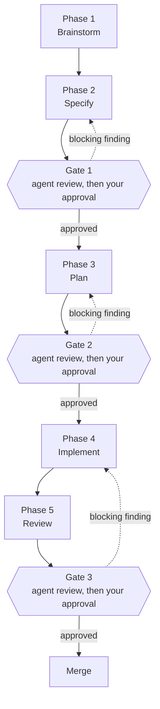
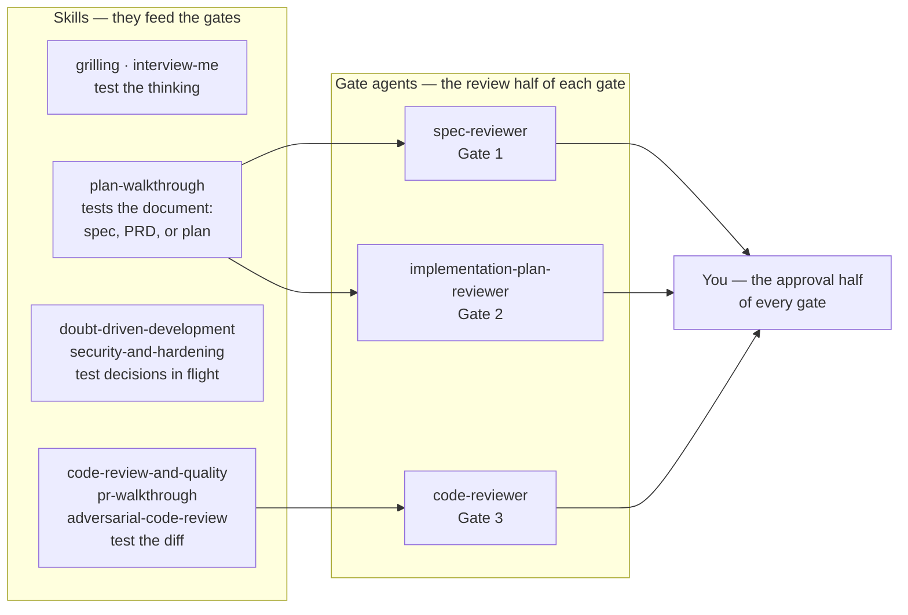
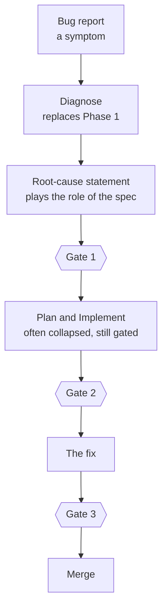

# WORKFLOW: how work moves through this harness

This document describes the shape of the development work — new features and bug fixing — and
the tools that implement each part of it.

It is a method, not a standard, and not the only way to use the pieces in this repository. It
is written down so that the method can be judged, copied, or argued with — separately from the
tools that happen to implement it today.

**This page is normative.** The phases, the gates and the artifacts are the parts that do not
move. Three companion documents carry what does:

| Document | What it is | Read it |
|---|---|---|
| [`workflow/TOOLS.md`](workflow/TOOLS.md) | reference — every tool once, and the four rules that decide whether two of them compose | one section at a time, when you need it |
| [`workflow/MAP-TO-SPEC.md`](workflow/MAP-TO-SPEC.md) | a runbook for one route: a closed `wayfinder` map turned into specs | only if you are on that route |
| [`workflow/WRITE-AND-REVIEW.md`](workflow/WRITE-AND-REVIEW.md) | a playbook for the five moments where you choose between a skill, a gate agent, and your own reading — writing and reviewing the spec and the plan, and reviewing the diff | inside one of those moments |

The [README](README.md) tells you what is in the repository. This document tells you what
the repository is *for*.

## Contents

- [Four words: phase, artifact, route, tool](#four-words-phase-artifact-route-tool)
- [The pipeline](#the-pipeline)
- [The three gates](#the-three-gates)
- [Who reviews what](#who-reviews-what)
- [The artifact ledger](#the-artifact-ledger)
- [Choosing a route](#choosing-a-route)
- [Phase 1 — Brainstorm](#phase-1--brainstorm)
- [The transition: intent to spec](#the-transition-intent-to-spec)
- [Phase 2 — Specify](#phase-2--specify)
- [The transition: spec to plan](#the-transition-spec-to-plan)
- [Phase 3 — Plan](#phase-3--plan)
- [Phase 4 — Implement](#phase-4--implement)
- [Phase 5 — Review](#phase-5--review)
- [Where to go next](#where-to-go-next)

---

## Four words: phase, artifact, route, tool

This is the idea the whole document rests on, so it comes first.

A **phase** is a durable step in the work. It has a goal, it produces an artifact, and it ends
at a stated exit criterion.

An **artifact** is what crosses the boundary between two phases. It is a file, at a known
path, that the next phase reads. Everything that is not written into an artifact is dropped
at the boundary — whatever was said in the conversation.

A **route** is one worked path through all five phases: a tool per phase, chosen once at the
start from the shape of the job. Routes are advisory. They exist because "what can implement
Phase 3" is a different question from "what does this whole job look like" — and the second
one is the question you actually face on a Monday morning.

A **tool** is one way to reach a phase's exit criterion. In Claude Code a tool is a skill, a
subagent, a rule, or a mode a plugin installs through a hook. Tools change often. A tool can
be replaced without moving the phase it serves.

Two consequences follow:

> **Swapping a tool does not change the workflow. Skipping a phase does.**
>
> **A phase is identified by the artifact it produces, not by the tool that produces it.**

It is tempting to draw the pipeline with tool names inside the boxes. Do not. The diagram
would describe one implementation and call it the workflow. A reader could no longer tell
which boxes are durable and which are replaceable. The human approval steps — the part that
matters most — would disappear, because no tool represents them.

So the diagram carries phase names only, every tool lives in
[`workflow/TOOLS.md`](workflow/TOOLS.md), and the routes below name tools **as an example of
one good choice**, never as a requirement.

## The pipeline

Read it as five phases and three gates. Work moves forward only through a gate. A blocking
finding sends the work back one phase — never forward into the next one.

The same pipeline, drawn as artifacts, shows what each phase hands to the next:

```mermaid
flowchart LR
    P1["Phase 1<br/>Brainstorm"] -->|"intent · idea<br/>design doc · map"| P2["Phase 2<br/>Specify"]
    P2 -->|"spec + capability map<br/>or PRD + specs"| G1{{"Gate 1<br/>reads the spec"}}
    G1 -->|approved| P3["Phase 3<br/>Plan"]
    P3 -->|"plan + task list"| G2{{"Gate 2<br/>reads the plan"}}
    G2 -->|approved| P4["Phase 4<br/>Implement"]
    P4 -->|"the diff"| P5["Phase 5<br/>Review"]
    P5 --> G3{{"Gate 3<br/>reads the diff"}}
    G3 -->|approved| M["Merge"]
```

The artifact is the only thing that crosses a boundary. At the intent-to-spec boundary, the
conversation is dropped. At the spec-to-plan boundary, the reasoning is dropped on purpose:
the *why* stays in the spec and in the ADRs. If a reason matters, it must already live in an
artifact.

## The three gates

A gate is not one review. It is **two reviews in sequence**, and neither one replaces the
other:

1. **The agent review.** A reviewer subagent with a fresh context window reads the artifact
   and reports blocking findings first, each with a concrete fix. Fresh context matters: a
   long session quietly turns its own assumptions into facts, and the agent that wrote the
   spec is the worst possible agent to check it.
2. **The human approval.** You read the artifact and the findings, and you decide. An agent
   can tell you that a spec contradicts itself. It cannot tell you that the feature is not
   worth building.

| Gate | After phase | Automated check | Your decision |
|---|---|---|---|
| **Gate 1** | Specify | `spec-reviewer` reads the spec against the real codebase | Approve the spec, or send it back with what you disagree with |
| **Gate 2** | Plan | `implementation-plan-reviewer` opens every file and step the plan names | Approve the plan, or send it back |
| **Gate 3** | Review | `code-reviewer` reads the diff | Approve the merge, or send the code back |

**No route waives either half.** Some tools stop and ask for your approval on their own —
`writing-prds` does, before it decomposes a PRD into tasks. That stop is the *human* half,
requested by the agent that just wrote the document, in the session that wrote it. It is not
the gate. Run the reviewer first and answer the stop having read its findings. You still
approve once; you just read the review before you do.

The subagents that run these checks are described in [`agents/README.md`](agents/README.md).
They implement the gates. They are not the gates.

## Who reviews what

Several tools review, and they are not interchangeable. Each one tests a different object,
and most of them are not gates — they feed one.

| Object under review | Skill that feeds the gate | Gate agent | You |
|---|---|---|---|
| the decisions, while you think | `grilling`, `interview-me` | — | answer, defend, or change the decision |
| the spec or PRD | `plan-walkthrough` (Phase 2 use, EDIT mode) | `spec-reviewer` (Gate 1) | approve the document, or send it back |
| the plan | `plan-walkthrough` (Phase 3 use) | `implementation-plan-reviewer` (Gate 2) | approve the plan, or send it back |
| ledger ↔ document traceability, on Route D | `plan-walkthrough`, with the decision ledger as its reference set | feeds Gate 1 | read the matrix in both directions |
| the code, decision by decision, while it is written | `doubt-driven-development`, `security-and-hardening` | — | — |
| the diff or PR | `code-review-and-quality` (broad pass), `pr-walkthrough` (logical pass), `adversarial-code-review` (heavy, optional) | `code-reviewer` (Gate 3) | approve the merge |

**Skill, agent, or both?** A skill reviews *with* you. It is interactive: it walks you
through its findings, asks you to triage each one, and writes a dossier. A gate agent reviews
with fresh eyes. It has a clean context window, it reads the real codebase, and it returns
blocking findings with concrete fixes. When you use both, the order is: **skill first, agent
second, you last.** The skill finds and fixes problems while editing is cheap. The agent then
checks the corrected document against reality. You decide. The other order wastes the agent
on a document the skill was about to change.

**What `plan-walkthrough` shows, and what it does not.** It works on any plan-shaped
document: a spec, a PRD, a plan, or an issue. It asks one question before anything else: is
this document yours to edit (EDIT mode), or someone else's (QUESTIONS mode)? When to take
which is in [`workflow/WRITE-AND-REVIEW.md`](workflow/WRITE-AND-REVIEW.md); what each mode
does is in [`workflow/TOOLS.md`](workflow/TOOLS.md#phase-3--plan). Its dossier shows the
*document* — a
phase-and-dependency graph, a traceability matrix, and an assumption map checked against the
real codebase. Its diagrams do not show the system's architecture. If you need an
architecture picture before code exists, the design comes from `architect` or from a
`prototype`. After code exists, `pr-walkthrough` draws before-and-after architecture diagrams
of the change.

`grilling` and `interview-me` sit upstream of every document, and
`doubt-driven-development` and `security-and-hardening` work inside Phase 4. They feed the
artifacts that the gates then read.

## The artifact ledger

Every path the workflow writes to is defined here, once. No other document in this repository
restates a path; they name the artifact **key** and link back to this table.

| Artifact | Path | Phase | Written by | Read by | Lifetime |
|---|---|---|---|---|---|
| intent | `docs/intent/[topic].md` | 1 | `interview-me` (the file is optional) | Phase 2 | canonical |
| idea | `docs/ideas/[idea-name].md` | 1 | `idea-refine` | Phase 2 | canonical |
| design doc | `docs/superpowers/specs/YYYY-MM-DD-<topic>-design.md` | 1–2 | `brainstorming` | Gate 1, `writing-prds` | canonical |
| map | the issue tracker, label `wayfinder:map` | 1 | `wayfinder` | the map-to-spec runbook | canonical |
| research note | wherever the repo already keeps notes — **the skill must tell you where** | 1 | `research` | the ticket that waits on it | canonical |
| prototype | throwaway code, linked from its ticket | 1 | `prototype` | the ticket | ephemeral |
| domain model | `CONTEXT.md`, the glossary, an ADR | 1–2 | `domain-modeling` | everyone, afterwards | canonical |
| decision ledger | none — it is held in the session | 2 | the [map-to-spec runbook](workflow/MAP-TO-SPEC.md) | `writing-prds`, `to-spec`, the audit | **ephemeral** |
| PRD | `docs/prd/YYYY-MM-DD-<topic>.md` | 2 | `writing-prds` | Gate 1, Phase 3 | canonical |
| capability map | at the project root, beside the specs it indexes | 2 | `spec-driven-development` Phase 0 | Gate 1, Phase 3 | canonical |
| spec | `SPEC-<module-id>.md`, beside the capability map | 2 | `spec-driven-development`, `to-spec` | Gate 1, Phase 3 | canonical |
| ADR | as `documentation-and-adrs` defines | 2, 5 | `documentation-and-adrs` | forever | canonical, **append-only** |
| plan | `docs/superpowers/plans/YYYY-MM-DD-<feature>.md` | 3 | `writing-plans` | Gate 2, Phase 4 | canonical |
| task list | `tasks/plan.md` and `tasks/todo.md`, or the project's tracker | 3 | `spec-driven-development`, `planning-and-task-breakdown` | Phase 4 | ephemeral |
| plan review | `.reviews/plans/<slug>.md` | 2–3 | `plan-walkthrough` | you | ephemeral |
| progress | `<workspace>/progress.md` | 4 | `subagent-driven-development` | you, and the next session | ephemeral |
| PR review | `.reviews/prs/PR-<n>.md` | 5 | `pr-walkthrough` | Gate 3 | ephemeral |
| architecture report | an HTML report | 5 | `improve-codebase-architecture` | you | ephemeral |
| handoff | the OS temp directory — **never the workspace** | any | `handoff` | the next session | ephemeral |
| deck | a slides markdown plus a fully-local reveal.js build | any | `slides` | your audience | canonical |

Three rules apply to everything in the table.

**Canonical or ephemeral, and never both.** A canonical artifact is the source of truth for
what it states, and it is edited in place. An ephemeral artifact is a build product: it is
regenerable from the canonical ones, and it must never become a second source of truth. The
decision ledger is the sharp case — it is regenerable by re-reading the map's tickets, and
the moment it is treated as durable there are two records of the same decisions.

**A spec describes the system now.** When it changes, edit the sentence — never append a
revision note. History lives in version control and in ADRs, because a spec that carries its
own changelog stops being readable as a description of anything. An ADR is the opposite: one
decision, append-only. A file trying to be both ages into neither.

**The review directories are not committed.** `.reviews/` belongs in `.git/info/exclude`, not
in `.gitignore` — it is a local working surface, and putting it in a tracked ignore file
imposes it on everyone who clones the repo.

## Choosing a route

A route names one tool per phase. It is a worked example, not a rule: any tool in
[`workflow/TOOLS.md`](workflow/TOOLS.md) can stand in for the one a route names, and the
workflow is unchanged.

A path earns a place as a named route only if it **changes the tool at two or more phases**.
That is what keeps the list short: near-duplicates do not earn a name.

| If… | Take |
|---|---|
| you can name the file before you start | [Route A — the one-line change](#route-a--the-one-line-change) |
| the scope is clear and the shape of the solution is obvious | [Route B — the standard feature](#route-b--the-standard-feature) |
| the structural question is genuinely open | [Route C — open shape](#route-c--open-shape) |
| the work is bigger than one agent session | [Route D — the multi-session map](#route-d--the-multi-session-map) |
| you have a symptom and no cause | [Route E — the bug](#route-e--the-bug) |
| the code is correct and the wrong shape | [Route F — architecture debt](#route-f--architecture-debt) |

### Route A — the one-line change

A one-line change does not need a five-page spec. It still needs a stated intent, a named
exit criterion, and a review. **The phase survives; only its size changes.**

| Phase | Tool | Artifact left behind | Your part |
|---|---|---|---|
| 1 Brainstorm | you, one sentence | *"I want X, because Y"* | write the sentence, not just think it |
| 2 Specify | you, three lines | what will be true afterwards | read them once as if someone else wrote them |
| 3 Plan | you | the list of files you are about to touch | — |
| 4 Implement | the edit | the diff | — |
| 5 Review | `code-reviewer` | — | **approve the merge, or send it back** |

The same scaling applies to every route, so it is worth naming the full range:

| Phase | Full size | Smallest legal version |
|---|---|---|
| Brainstorm | An interview, then a stress test | One sentence from you: "I want X, because Y" |
| Specify | A spec document with a capability map | Three lines describing what will be true afterwards |
| Plan | An ordered, file-level plan | A list of the files you are about to touch |
| Implement | Incremental delivery with checkpoints | The edit |
| Review | A full multi-axis review | `code-reviewer` on the diff, and you read it |

The failure mode this table exists to prevent is not "too much process". It is discovering,
halfway through, that a small task has turned out to be large — and that you skipped the
process for reasons that felt good at the time.

### Route B — the standard feature

**The default.** Take this one unless something below fits better.

| Phase | Tool | Artifact left behind | Your part |
|---|---|---|---|
| 1 Brainstorm | `interview-me`, then `grilling` | intent | answer honestly, then defend the idea or change it |
| 2 Specify | `spec-driven-development` | capability map, spec | **Gate 1 — approve, or send it back** |
| 3 Plan | `writing-plans` | plan | **Gate 2 — approve, or send it back** |
| 4 Implement | `incremental-implementation` | — | keep the steps small |
| 5 Review | `code-reviewer` | — | **Gate 3 — approve the merge** |

`interview-me` then `grilling` gives the most value per minute spent in Phase 1, because the
two tools disagree with each other by design: the interview extracts what you mean, the
grilling attacks what you meant.

**Cost:** one conversation and one document per phase. **When it is wrong:** when you cannot
honestly answer "what do you want?" — then take Route C.

### Route C — open shape

The structural question is unanswered. You know the problem; you do not know where the code
should live.

| Phase | Tool | Artifact left behind | Your part |
|---|---|---|---|
| 1 Brainstorm | `idea-refine`, then `interview-me`, then `architect` **last** | idea, intent | pick the direction, then choose between the alternatives `architect` names |
| 2 Specify | `architect` → `spec-driven-development` | capability map, spec | **Gate 1** |
| 3 Plan | `planning-and-task-breakdown` → `writing-plans` | task list, plan | **Gate 2** |
| 4 Implement | `executing-plans` | — | review at each checkpoint |
| 5 Review | `pr-walkthrough` first if the diff is large, then `code-reviewer` | PR review | **Gate 3** |

This route pays off at Gate 1: `spec-reviewer` explicitly looks for "simpler alternatives
that meet the same requirements", so a spec written from a design that already names its
rejected alternatives removes a whole review round.

**Cost:** two extra passes before a line is written. **When it is wrong:** for routine work.
`architect` will tell you in one line if the task is too small to need architecture — take
that answer and drop back to Route B.

### Route D — the multi-session map

The work does not fit in one agent session, so the plan itself has to be built incrementally
and survive between sessions.

Enter this route with a direction, not a blank page: `idea-refine` first (or `interview-me`),
then `wayfinder` charts the map toward it. The one-pager names the destination; the map works
out how to get there.

| Phase | Tool | Artifact left behind | Your part |
|---|---|---|---|
| 1 Brainstorm | `idea-refine`, then `wayfinder`, which dispatches `research`, `prototype`, and `grilling` + `domain-modeling` itself | idea, map, research notes, prototypes, domain model | resolve **one ticket per session**; never stand in for the human side of a grilling ticket |
| 2 Specify | [the map-to-spec runbook](workflow/MAP-TO-SPEC.md): decision ledger → `spec-driven-development` Phase 0 → `writing-prds` above, `to-spec` per capability | decision ledger *(ephemeral)*, PRD, spec | approve the capability map **before** a single spec is written, then **Gate 1** on each document |
| 3 Plan | `writing-plans` once per task — **no breakdown pass** | plan | **Gate 2** |
| 4 Implement | `subagent-driven-development` | progress | watch the ledger; it is how a fresh session resumes |
| 5 Review | `/adversarial-code-review` first when the change is merge-bound and risky, then `code-reviewer` | — | **Gate 3** — read the verified verdict, then merge explicitly |

Two things about this route are easy to get wrong, and both are covered in the runbook: a
closed map is **not** a spec, and the PRD's phases **are** the task breakdown, so running
`planning-and-task-breakdown` over them re-derives a dependency graph that was settled when
the phases were.

**Cost:** the highest of any route, spread over many sessions. **When it is wrong:** whenever
the work does fit in one session.

### Route E — the bug

Bug fixing uses the same five phases. Only the entry changes.

| Phase | Tool | Artifact left behind | Your part |
|---|---|---|---|
| 1 Diagnose | `diagnosing-bugs`, or `systematic-debugging` | — | **do not accept a symptom fix** |
| 2 Specify | you: the cause, in one sentence | the root-cause statement | **Gate 1**, however short |
| 3 Plan | usually one paragraph, collapsed into Phase 2 | — | **Gate 2**, however short |
| 4 Implement | the fix | the diff | — |
| 5 Review | `code-reviewer` | — | **Gate 3** |

Two things stay non-negotiable in this lane:

- **A symptom fix is a failure.** A bug report names a symptom. The phase is not finished
  until you can state the cause in one sentence. That sentence is the spec.
- **The gates still apply.** A small fix can collapse Specify and Plan into one short
  paragraph, but each still gets an agent review and your approval before it merges.

### Route F — architecture debt

The code is correct and the wrong shape. There is no feature to build, so Phase 1 is not an
interview — it is a survey of the code itself.

| Phase | Tool | Artifact left behind | Your part |
|---|---|---|---|
| 1 Brainstorm | `/improve-codebase-architecture`, which dispatches `codebase-design` and `domain-modeling` itself | architecture report, domain model | pick **one** opportunity from the report |
| 2 Specify | `documentation-and-adrs` — the target shape, and why this way and not another | ADR | **Gate 1** on the ADR |
| 3 Plan | `writing-plans` | plan | **Gate 2** |
| 4 Implement | `incremental-implementation` | — | the behaviour must not change |
| 5 Review | `code-reviewer`, then `ponytail-review`, then `code-simplification` | — | **Gate 3** |

**Cost:** low per opportunity, unbounded if you take more than one at a time — which is why
the Phase 1 part ends by picking one. **When it is wrong:** when the shape is wrong *because*
a feature is arriving. Then it is Route B or C, and the reshaping is part of the feature.

### Switching route mid-flight

Three signals mean you are on the wrong route. None of them means "try harder".

- **The plan will not sequence cleanly.** The design underneath it is wrong. Go back to Phase
  2 and take Route C.
- **A phase keeps reopening a question you thought was closed.** Something is unwritten. The
  artifact for the previous phase does not exist, or does not say what you remember saying.
- **You have run out of session and the map is not finished.** You are on Route D whether you
  chose it or not. Write the `handoff`, then start the map.

---

## Phase 1 — Brainstorm

**Goal.** Turn a vague request into a stated intent, with agreed scope.

**Artifact.** intent, or idea, or design doc, or map — whichever the route writes. What
matters is that one of them exists as a file.

**Done when.** You and the agent agree on what is being built and why, and the open
questions have answers. Nothing is written as a spec yet.

**Why this phase exists.** Most bad software is built correctly. The expensive failure is
not a bug — it is a well-built feature that nobody needed, because the first conversation
skipped the question "what are you actually trying to do?". This phase is cheap. Every later
phase is not.

**How it runs.**

1. Write the request down as one sentence: *what you want, and why*.
2. Pick the tool that fits the shape of the work — the
   [routes](#choosing-a-route) and [`workflow/TOOLS.md` → Phase 1](workflow/TOOLS.md#phase-1--brainstorm)
   are the menu; the default is `interview-me`, then `grilling`.
3. Work with the tool until you and the agent agree on what is being built and why, and the
   open questions have answers.
4. Check that the artifact exists as a file before you move on.

## The transition: intent to spec

This is the boundary the workflow loses most often, and it loses it quietly.

**What must cross.** Four things, and each has to be written down somewhere:

- the problem, stated as a problem and not as a feature request;
- the scope you agreed on;
- the decisions already closed, and what each one rules;
- the **non-goals** — the work you ruled out on purpose.

**What gets dropped.** Everything else. The conversation does not cross the boundary; only
the artifact does. If the reason behind a decision exists only in the chat log, the spec will
restate the decision without it, and the first person to question the decision will reopen it.

**Three ways it happens.**

| From | To | What you trade |
|---|---|---|
| a conversation only — `brainstorming` carries you across and leaves a design doc | Gate 1 | Cheapest, and weakest: intent and spec arrive together, so there is no separate stated intent to check the spec against. |
| an intent or idea document → `spec-driven-development` | a capability map and one spec per capability | The normal path. The intent exists as a file, so Gate 1 has something to measure the spec against. |
| a closed `wayfinder` map → [the map-to-spec runbook](workflow/MAP-TO-SPEC.md) | a PRD and one spec per capability | The most expensive, and the only one where the decisions were settled before the document was written. |

**The failure mode.** The spec restates the feature request instead of the problem, and
Gate 1 cannot catch it: `spec-reviewer` reads the spec against the *codebase*, not against an
earlier artifact. If no intent was written, nothing in the pipeline can tell you that the
spec is answering the wrong question. That is the whole argument for writing Phase 1 down
even when it is one sentence.

## Phase 2 — Specify

**Goal.** Produce a document that states what will be true when the work is done.

**Artifact.** a spec — one per capability, indexed by a capability map when there is more than
one — or a PRD. See the [ledger](#the-artifact-ledger).

**Done when.** The spec exists and has passed **Gate 1**.

**Why this phase exists.** The spec is the artifact that makes the rest of the pipeline
possible. The plan is derived from it, the implementation is checked against it, and the
review measures the diff against it. Without a spec, "done" is an opinion.

**How it runs.**

1. Start from the Phase 1 artifact. Arriving from a closed `wayfinder` map is a different
   job — that is [`workflow/MAP-TO-SPEC.md`](workflow/MAP-TO-SPEC.md), the only part of this
   workflow with its own runbook.
2. Write the document with the Phase 2 tool — the default is `spec-driven-development`; add
   `architect` before it when the shape is open. The full menu is
   [`workflow/TOOLS.md` → Phase 2](workflow/TOOLS.md#phase-2--specify); the worked choice —
   document shape, tool, and review pass — is
   [`workflow/WRITE-AND-REVIEW.md`](workflow/WRITE-AND-REVIEW.md).
3. Run `plan-walkthrough` on the finished document, in EDIT mode, when it is long or when
   you want a structured check before the gate. It tests the document's structure and its
   claims against the real codebase, and it applies the fixes you accept.
4. Run **Gate 1**: `spec-reviewer` first, then you approve.

### Gate 1

`spec-reviewer` (subagent, `opus`) reads the spec on four axes: correctness (internal
consistency, unstated assumptions, requirements that contradict each other or the codebase),
architecture (boundaries, failure modes, and whether a **simpler** design meets the same
requirements), security (trust boundaries, authorisation gaps, data exposure), and
maintainability (coupling, migration, rollback, operational burden).

It returns a ranked list, blocking findings first, each with a concrete fix. If the spec is
sound it says so in one paragraph. It does not restate the spec back at you.

Then you approve — or you do not.

## The transition: spec to plan

**What must cross.** The acceptance criteria, the module boundaries, the build order the spec
implies, and the decisions that constrain sequencing. A plan that names a file the spec never
mentioned is a plan that has quietly widened the scope.

**What gets dropped.** The reasoning. A plan is instructions for someone with no context, so
the *why* stays in the spec and in the ADRs. This is on purpose, and it is why the plan must
name the spec it came from.

**Four ways it happens.**

| From | Route | How |
|---|---|---|
| a spec, and you can already say what step one is | B | `writing-plans` directly. A separate breakdown pass would add a document and no information. |
| a spec, and you **cannot** say what step one is | C | `planning-and-task-breakdown` first, then `writing-plans`. Not being able to name step one is the signal — not the size of the change. |
| a PRD written by `writing-prds` | D | Its phases already **are** the breakdown: one task per phase. Run `writing-plans` once per task, with **no** breakdown pass. |
| a capability map from `spec-driven-development` | B or C | Its task list already exists. Run `writing-plans` per task, in the approved build order. |

**The failure mode.** Re-deriving a dependency graph that Phase 2 already settled, and then
acting on the second derivation when the two disagree. The graph is not wrong because the
second pass is careless; it is wrong because two derivations of the same thing will differ,
and nothing tells you which one the spec meant.

## Phase 3 — Plan

**Goal.** Turn the approved spec into an ordered list of implementable steps that name real
files.

**Artifact.** plan, and sometimes a task list.

**Done when.** The plan exists and has passed **Gate 2**.

**Why this phase exists.** A spec says what should be true. It does not say in what order to
make it true, and order is where most implementations go wrong: a step that leaves the build
broken for the next three steps costs more than the feature saved.

**How it runs.**

1. Choose the breakdown path from [the transition above](#the-transition-spec-to-plan).
2. Write the plan with `writing-plans`, or pick another tool from
   [`workflow/TOOLS.md` → Phase 3](workflow/TOOLS.md#phase-3--plan). The worked choice
   between them is [`workflow/WRITE-AND-REVIEW.md`](workflow/WRITE-AND-REVIEW.md).
3. Run `plan-walkthrough` on the plan when it is long, or when it arrived from outside this
   pipeline.
4. Run **Gate 2**: `implementation-plan-reviewer` first, then you approve.

**One plan or many.** One plan per spec is the default. On Route D, where the PRD's phases
are the task breakdown, the default is one plan per task. Split a plan only when
`writing-plans` says the spec spans several subsystems. Never re-derive the breakdown to make
the plans line up: the dependency graph was settled in Phase 2, and a second derivation of
the same graph will disagree with the first.

### Gate 2

`implementation-plan-reviewer` (subagent, `opus`) does something the other reviewers do not:
it **opens the files the plan names**. A plan that references a function which does not
exist is the most common and most expensive planning failure, and it stays invisible until
execution starts.

It also checks that the step order keeps the build and the tests green throughout, and it
looks for what is missing rather than only for what is wrong: migrations, configuration,
tests, documentation, rollout and rollback. Finally it flags risk — irreversible steps,
security-sensitive changes, hidden coupling between steps.

Then you approve.

## Phase 4 — Implement

**Goal.** Land the change in small, verifiable steps.

**Artifact.** the diff, and `progress` when subagents are doing the work.

**Done when.** The change is complete and the build and the tests are green.

**Why this phase has no gate of its own.** It is bounded by Gate 2 behind it and Gate 3 in
front of it. A third checkpoint inside it would slow the one phase where speed is actually
useful.

**How it runs.**

1. Pick **one** execution context: `incremental-implementation` in this session,
   `executing-plans` in a separate one, or `subagent-driven-development` across subagents in
   this one. `executing-plans` is the strongest base for anything long, for the same reason
   the gates use fresh reviewers.
2. Add extra scrutiny only where it earns its cost: `doubt-driven-development` at specific
   decisions, `security-and-hardening` wherever the code touches untrusted input,
   authentication, storage, or a third party. The menu is
   [`workflow/TOOLS.md` → Phase 4](workflow/TOOLS.md#phase-4--implement).
3. Land the change in small, verifiable steps. Keep the build and the tests green throughout.

## Phase 5 — Review

**Goal.** Make sure nothing merges unreviewed.

**Artifact.** the review itself, and a PR review when `pr-walkthrough` ran.

**Done when.** Findings are fixed or explicitly accepted, and you approve the merge.

**Why this phase exists.** Every earlier gate judged a *document*. This is the only one that
judges what actually shipped, and the diff is the only artifact a user will ever experience.

**How it runs.**

1. Decide how much review the diff needs. **For most work, `code-reviewer` alone is
   enough.** If you feel the urge to stack reviewers, that is usually a sign that Gate 1 or
   Gate 2 was too thin — fix the earlier gate instead.
2. When you do add a skill pass, it runs **before** the gate agent, in the fixed order —
   [skill first, agent second, you last](#who-reviews-what). `code-review-and-quality` for a
   broad pass, `pr-walkthrough` for a logical review above the code,
   `/adversarial-code-review` for heavy, merge-bound changes. Within the code level, keep
   one order: **correctness first, clarity second, security wherever it applies.** The menu
   is [`workflow/TOOLS.md` → Phase 5](workflow/TOOLS.md#phase-5--review); the step sequences
   are in [`workflow/WRITE-AND-REVIEW.md`](workflow/WRITE-AND-REVIEW.md).
3. Run **Gate 3**: read the findings, fix or explicitly accept each one, then approve the
   merge.
4. Close out — see below.

### Gate 3

`code-reviewer` (subagent, `opus`) reads the diff — logic errors, security, needless
complexity — and reports only findings it is confident about, most severe first, each with a
`file:line` and a concrete fix. It is the only agent in this repository with `Bash`, for
exactly one reason: it runs `git diff` and collects the diff itself.

Then you approve the merge, or you send the code back.

None of the other review tools is the gate. They only feed it. The full picture of which
tool reviews which object is in [Who reviews what](#who-reviews-what).

### Closing out

The phase is not finished when the code merges. Four short steps keep the written record
from drifting away from the code: `documentation-and-adrs` records the decision the work
embodied, `consolidate-specs` realigns the spec to the code it now describes,
`consolidate-comments` deletes the comments that only restate that code, and `handoff`
compacts the session if the work continues elsewhere.

Run these at the end of a feature or an epic — **never in the middle of an implementation**.
See [`workflow/TOOLS.md` → Closing out](workflow/TOOLS.md#closing-out).

---

## Where to go next

| If you want… | Read |
|---|---|
| the tool for a phase, and whether two tools compose | [`workflow/TOOLS.md`](workflow/TOOLS.md) |
| the worked choice between a skill, an agent, or both, at any writing or reviewing moment | [`workflow/WRITE-AND-REVIEW.md`](workflow/WRITE-AND-REVIEW.md) |
| the table to reopen at nine in the morning | [`workflow/TOOLS.md` → Start here](workflow/TOOLS.md#start-here-what-am-i-holding) |
| the runbook for a closed `wayfinder` map | [`workflow/MAP-TO-SPEC.md`](workflow/MAP-TO-SPEC.md) |
| what each reviewer subagent checks | [`agents/README.md`](agents/README.md) |
| where every skill comes from, and how to obtain it | [`skills/README.md`](skills/README.md) |
| what is in this repository, and how to install it | [`README.md`](README.md) |
