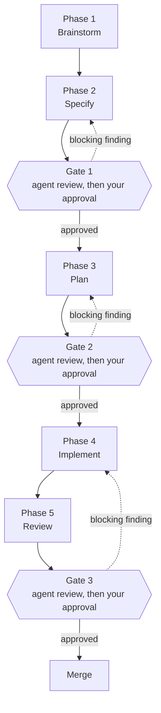
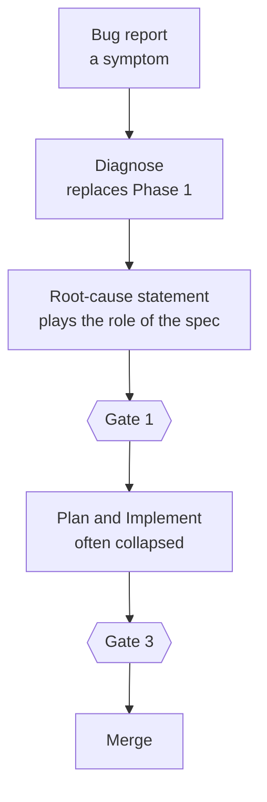

# WORKFLOW: how work moves through this harness

This document describes the shape of my development work — for new features and for bug
fixing — and the tools that implement each part of it.

It is a personal workflow. It is not a standard, and it is not the only way to use the
pieces in this repository. It is written down for one reason: so that the shape can be
judged, copied, or argued with, separately from the tools that happen to implement it
today.

The [README](README.md) tells you what is in the repository. This document tells you what
the repository is *for*.

## Contents

- [A phase is not a tool](#a-phase-is-not-a-tool)
- [The pipeline](#the-pipeline)
- [The three gates](#the-three-gates)
- [Phase 1 — Brainstorm](#phase-1--brainstorm)
- [Phase 2 — Specify](#phase-2--specify)
- [Phase 3 — Plan](#phase-3--plan)
- [Phase 4 — Implement](#phase-4--implement)
- [Phase 5 — Review](#phase-5--review)
- [The bug-fixing lane](#the-bug-fixing-lane)
- [Scale down, never skip](#scale-down-never-skip)
- [Any moment: the cross-cutting tools](#any-moment-the-cross-cutting-tools)
- [Cheatsheet](#cheatsheet)
- [Getting the tools](#getting-the-tools)

---

## A phase is not a tool

This is the idea the whole document rests on, so it comes first.

A **phase** is a durable step in the work. It has a goal, it produces an artifact, and it
ends at a stated exit criterion. The five phases below have not changed in a year, and I do
not expect them to change soon.

A **tool** is one way to reach that exit criterion. In Claude Code a tool is a skill, a
subagent, or a rule. Tools change often. I replaced my brainstorming tool twice in six
months, and the phase itself never moved.

The practical consequence:

> **Swapping a tool does not change the workflow. Skipping a phase does.**

It is tempting to draw the pipeline with tool names inside the boxes. That looks precise, and
it is a mistake: it describes one implementation and calls it the workflow. A reader cannot
tell which boxes are durable and which are replaceable, and the human approval steps — the
part that matters most — disappear entirely, because no tool represents them.

So in this document the diagram carries phase names only. Every tool lives in a table under
the phase it can implement, and every phase lists more than one option.

## The pipeline

Read it as five phases and three gates. Work moves forward only through a gate. A blocking
finding sends the work back one phase — never forward into the next one.

## The three gates

A gate is not one review. It is **two reviews in sequence**, and neither one replaces the
other:

1. **The agent review.** A reviewer subagent with a fresh context window reads the artifact
   and reports blocking findings first, each with a concrete fix. Fresh context matters: a
   long session quietly turns its own assumptions into facts, and the agent that wrote the
   spec is the worst possible agent to check it.
2. **The human approval.** I read the artifact and the findings, and I decide. An agent can
   tell me that a spec contradicts itself. It cannot tell me that the feature is not worth
   building.

| Gate | After phase | Automated check | Your decision |
|---|---|---|---|
| **Gate 1** | Specify | `spec-reviewer` reads the spec against the real codebase | Approve the spec, or send it back with what you disagree with |
| **Gate 2** | Plan | `implementation-plan-reviewer` checks every file and step the plan names | Approve the plan, or send it back |
| **Gate 3** | Review | `code-reviewer` reads the diff | Approve the merge, or send the code back |

The subagents that run these checks are described in [`agents/README.md`](agents/README.md).
They implement the gates. They are not the gates.

---

## Phase 1 — Brainstorm

**Goal.** Turn a vague request into a stated intent, with agreed scope.

**Done when.** You and the agent agree on what is being built and why, and the open
questions have answers. Nothing is written as a spec yet.

**Why this phase exists.** Most bad software is built correctly. The expensive failure is
not a bug — it is a well-built feature that nobody needed, because the first conversation
skipped the question "what are you actually trying to do?". This phase is cheap. Every later
phase is not.

### What can implement it

| Tool | Kind | Comes from | What it does, and when to reach for it |
|---|---|---|---|
| `interview-me` | skill | `agent-skills` | Asks you one question at a time until it is about 95% confident that it understands the *underlying* intent — not the feature you asked for, but the problem behind it. Reach for it whenever a request is underspecified, or when you catch yourself filling in requirements silently. |
| `idea-refine` | skill | `agent-skills` | Structured divergent then convergent thinking: it first widens the set of options, then narrows it. Reach for it when the idea is still shapeless, or when you want alternatives before committing to one. |
| `grilling` | skill | `mattpocock-skills` | Adversarial questioning of a plan, decision, or idea. It is deliberately uncomfortable. Reach for it when the interview is finished but something still feels unresolved. |
| `brainstorming` | skill | `superpowers` | The all-in-one path. It first classifies how much process the request needs, then works through dialogue to a design. Reach for it when you want one skill to carry you from idea to draft design in a single conversation. |
| `wayfinder` | skill | `mattpocock-skills` | For work too large for a single agent session. It charts the route as decision tickets on the issue tracker, then resolves them one at a time. Reach for it when the destination is clear but the way there is not. |
| `architect` | subagent | **this repo** (`fable`) | Reads the real codebase, then proposes component boundaries, data flow, and where new code should live. It must name one or two rejected alternatives with their trade-offs. Reach for it when the open question is structural rather than about intent. |

### Ways to combine them

The tools above are not alternatives to pick one from. Most of the value comes from running
two or three of them in the right order.

| Combination | Best when | Why it works |
|---|---|---|
| `interview-me` alone | You know what you want; the agent does not. | One pass is enough to transfer the intent. Adding more tools only adds cost. |
| `interview-me` → `grilling` | A real feature, and you want the idea tested. | The two attack the idea from opposite directions. The interview *extracts* what you mean; the grilling *attacks* what you meant. Running the attack second means it has something solid to attack. |
| `idea-refine` → `interview-me` | You do not yet know what you want. | Refining widens the option set first, then the interview converges on the one you chose. Reversing this order interviews you about an idea you have not formed. |
| `idea-refine` → `interview-me` → `grilling` | A large or expensive feature. | The full pass: widen, converge, then attack. Slow, and worth it exactly when being wrong is more expensive than the extra conversation. |
| `brainstorming` alone | The idea and the design are naturally one conversation. | It classifies how much process the request needs and then follows that path, so it covers Phase 1 and part of Phase 2 in a single pass. Cheapest option — and the weakest, because it produces no separate stated intent to review. |
| `wayfinder` → `interview-me` per ticket | The work is larger than one agent session. | Wayfinder charts the route as decision tickets; each ticket is then small enough for a normal interview. |
| any of the above → `architect` | The remaining open question is structural. | `architect` designs well, but it designs whatever you point it at. Pointing it at an unclear intent produces a good design for the wrong thing. |

**Which is better.** For a normal feature, `interview-me` → `grilling` gives the most per
minute spent, because the two tools disagree with each other by design. Start with
`idea-refine` instead only when your honest answer to "what do you want?" is "I am not
sure". And `architect` goes last in this phase, never first.

**What not to combine.** Do not run `idea-refine` and `brainstorming` in the same pass —
both do divergent exploration, so the second one re-opens what the first one closed. The
same applies to `interview-me` and `grilling` *simultaneously*: in sequence they are
complementary, in parallel they compete, because one is trying to understand you while the
other is trying to break you. These two pairs also have overlapping trigger descriptions, so
leaving both model-invocable is how you get the wrong one firing.

### Scaling down

For a small, well-understood change this phase is one sentence written by you: *"I want X,
because Y."* That is still the phase. What you cannot skip is stating the intent before
writing the spec.

---

## Phase 2 — Specify

**Goal.** Produce a document that states what will be true when the work is done.

**Done when.** The spec exists and has passed **Gate 1** — reviewed by an agent, then
approved by you.

**Why this phase exists.** The spec is the artifact that makes the rest of the pipeline
possible. The plan is derived from it, the implementation is checked against it, and the
review measures the diff against it. Without a spec, "done" is an opinion.

### What can implement it

| Tool | Kind | Comes from | What it does, and when to reach for it |
|---|---|---|---|
| `spec-driven-development` | skill | `agent-skills` | Writes the specification before any code. When one requirement covers several independently testable capabilities, it decomposes them into a capability map of modules. Reach for it for any new feature or significant change. |
| `brainstorming` | skill | `superpowers` | Its later phases produce a design document directly, so it can cover Phase 1 and Phase 2 in one pass. Reach for it when the idea and the spec are naturally one conversation. |
| `architect` | subagent | **this repo** (`fable`) | Supplies the design the spec is written from: boundaries, data flow, failure modes, rejected alternatives, and a build order. Reach for it before the spec when the shape of the solution is genuinely open. |
| `documentation-and-adrs` | skill | `agent-skills` | Records a decision as an ADR. Reach for it when the spec contains a choice that future readers will question — the *why* belongs in an ADR, not in the spec. |

### Ways to combine them

| Combination | Best when | Why it works |
|---|---|---|
| `spec-driven-development` alone | Phase 1 produced a clear intent and the shape of the solution is obvious. | The intent is already settled, so the only remaining job is writing it down precisely. |
| `architect` → `spec-driven-development` | The change touches architecture, or the solution shape is genuinely open. | The spec is then written *from* a design that already names its rejected alternatives. This pays off immediately at Gate 1: `spec-reviewer` explicitly hunts for "simpler alternatives that meet the same requirements", so handing it the alternatives you already considered removes a whole review round. |
| `brainstorming` alone, covering Phase 1 and Phase 2 | A small, self-contained change. | One conversation from idea to draft design. The trade-off is that intent and spec arrive together, so there is no separate stated intent to check the spec against. |
| `spec-driven-development` → `documentation-and-adrs` | The spec contains a decision people will question later. | The spec says what will be true; the ADR says why this way and not another. Splitting them keeps the spec readable as a description. |
| `spec-driven-development` → `grilling` | The spec is written but you do not believe it yet. | A cheap self-check before you spend `spec-reviewer` on it. Use it when your own doubt is the blocker, not as a replacement for Gate 1. |

**Which is better.** `architect` → `spec-driven-development` is the strongest combination for
anything structural, and it is the one that most reliably shortens the gate. For routine
work, `spec-driven-development` alone is correct and adding `architect` is waste — it has an
explicit escape hatch for this, and will tell you in one line if the task is too small to
warrant architecture.

**What not to combine.** Do not merge the spec and the ADR into one document. A spec
describes the system now and gets edited in place; an ADR records one decision and is
append-only. A file trying to be both ages into neither.

### The rule that applies here

A spec describes the system **now**. When it changes, edit the sentence — never append a
revision note. History lives in version control and in ADRs, because a spec that carries its
own changelog stops being readable as a description of anything. This rule comes from my
global documentation rules rather than from this repository, but it shapes every spec the
workflow produces.

### Gate 1

`spec-reviewer` (subagent, `opus`) reads the spec on four axes: correctness (internal
consistency, unstated assumptions, requirements that contradict each other or the codebase),
architecture (boundaries, failure modes, and whether a **simpler** design meets the same
requirements), security (trust boundaries, authorisation gaps, data exposure), and
maintainability (coupling, migration, rollback, operational burden).

It returns a ranked list, blocking findings first, each with a concrete fix. If the spec is
sound it says so in one paragraph. It does not restate the spec back at you.

Then you approve — or you do not.

---

## Phase 3 — Plan

**Goal.** Turn the approved spec into an ordered list of implementable steps that name real
files.

**Done when.** The plan exists and has passed **Gate 2**.

**Why this phase exists.** A spec says what should be true. It does not say in what order to
make it true, and order is where most implementations go wrong: a step that leaves the build
broken for the next three steps costs more than the feature saved.

### What can implement it

| Tool | Kind | Comes from | What it does, and when to reach for it |
|---|---|---|---|
| `writing-plans` | skill | `superpowers` | Turns a spec or clear requirements into a written plan, before any code is touched. Reach for it for any multi-step task. |
| `planning-and-task-breakdown` | skill | `agent-skills` | Breaks work into ordered tasks, estimates scope, and identifies which parts can run in parallel. Reach for it when a task feels too large to start, or when you suspect parallel work is possible. |
| `dispatching-parallel-agents` | skill | `superpowers` | Prepares two or more genuinely independent tasks for parallel agents, giving each exactly the context it needs and nothing else. Reach for it only when the tasks share no state and have no ordering between them. |

### Ways to combine them

| Combination | Best when | Why it works |
|---|---|---|
| `writing-plans` alone | You can already say what the first step is. | If the order is obvious, a separate breakdown pass adds a document and no information. |
| `planning-and-task-breakdown` → `writing-plans` | You cannot say what the first step is. | The breakdown finds the tasks and the dependencies between them; `writing-plans` then turns that ordering into a plan that names real files. Not being able to name step one is the signal that you need this. |
| `planning-and-task-breakdown` → `dispatching-parallel-agents` → `writing-plans` | The breakdown revealed branches that share nothing. | Parallelism is decided *after* the dependencies are known, so each branch gets exactly the context it needs and no shared state. |
| `writing-plans` → `architect` (back one step) | The plan keeps failing to come out clean. | A plan that will not sequence usually means the design underneath it is wrong. This is a signal to go back to Phase 2, not to try harder at Phase 3. |

**Which is better.** `writing-plans` alone covers most work. The one reliable trigger for
adding `planning-and-task-breakdown` is not the size of the change but your own uncertainty
about where to start.

**What not to combine.** Do not run `dispatching-parallel-agents` before a breakdown.
Deciding what is parallel before you know the tasks is how you get two branches that both
edit the same file, which is worse than doing the work in sequence.

### Gate 2

`implementation-plan-reviewer` (subagent, `opus`) does something the other reviewers do not:
it **opens the files the plan names**. A plan that references a function which does not
exist is the most common and most expensive planning failure, and it stays invisible until
execution starts.

It also checks that the step order keeps the build and the tests green throughout, and it
looks for what is missing rather than only for what is wrong: migrations, configuration,
tests, documentation, rollout and rollback. Finally it flags risk — irreversible steps,
security-sensitive changes, hidden coupling between steps.

Then you approve.

---

## Phase 4 — Implement

**Goal.** Land the change in small, verifiable steps.

**Done when.** The change is complete and the build and the tests are green.

**Why this phase has no gate of its own.** It is bounded by Gate 2 behind it and Gate 3 in
front of it. A third checkpoint inside it would slow the one phase where speed is actually
useful.

### What can implement it

| Tool | Kind | Comes from | What it does, and when to reach for it |
|---|---|---|---|
| `incremental-implementation` | skill | `agent-skills` | Delivers the change in small steps instead of one large edit. Reach for it whenever the change touches more than one file, or when a task feels too big to land in one go. |
| `executing-plans` | skill | `superpowers` | Executes a written plan in a **separate session**, with review checkpoints between steps. Reach for it when the plan is long enough that carrying the planning conversation into the implementation would crowd the context window. |
| `subagent-driven-development` | skill | `superpowers` | Executes independent plan tasks in the **current** session by dispatching subagents. Reach for it when the plan has parallel branches and you want to stay in one conversation. |
| `doubt-driven-development` | skill | `agent-skills` | Materialises a fresh-context reviewer, biased to **disprove** rather than to approve, before a non-trivial decision stands. Reach for it in unfamiliar code, in security-sensitive logic, or before anything irreversible. |
| `security-and-hardening` | skill | `agent-skills` | Hardens code that accepts untrusted input, manages sessions, stores data, or talks to third parties. Reach for it while writing that code, not after. |
| `effort-escalation` | rule | **this repo** | Keeps reasoning effort at the default level. The agent may only *recommend* raising it — for deep multi-file debugging, an architecture decision with real trade-offs, a security-critical review, or a final verification pass — and must then wait for you to set it. |

### Ways to combine them

This phase has two independent choices: **where the execution context lives**, and **what
extra scrutiny you add on top**. Pick one from each.

First, where the work happens:

| Combination | Best when | Why it works |
|---|---|---|
| `incremental-implementation` alone | A multi-file change from a short plan. | Small steps in the current session. The plan is still close enough to hold in context. |
| `executing-plans` alone | The plan is long. | A separate session means the implementation is not carrying the whole planning conversation. This is the same reasoning that makes gate reviewers use fresh context: accumulated conversation turns assumptions into facts. |
| `executing-plans` + `incremental-implementation` | The plan is long **and** each step is itself multi-file. | The first governs the session boundary, the second governs step size. They answer different questions, so they stack cleanly. |
| `subagent-driven-development` alone | The plan has independent branches and you want to stay in one conversation. | Each branch runs in a subagent with constructed context, while you keep the coordinating view. |

Then, what you add on top:

| Addition | Add it when | Why it works |
|---|---|---|
| `doubt-driven-development` | At specific decisions: unfamiliar code, security-sensitive logic, anything irreversible. | A fresh-context reviewer biased to disprove. Apply it per decision, not to the whole phase — used everywhere it doubles the cost of everything, including the parts that were never in doubt. |
| `security-and-hardening` | The step touches untrusted input, authentication, storage, or a third party. | Hardening while writing that code is far cheaper than retrofitting it after Gate 3 sends it back. |

**Which is better.** `executing-plans` is the strongest base for anything long, for the same
reason the gates use fresh reviewers. Layer `doubt-driven-development` selectively on the
two or three steps you would not want to debug at three in the morning.

**What not to combine.** `executing-plans` and `subagent-driven-development` are two
different answers to the same question — separate session, or subagents in this one. Running
both means the plan is being executed in two places with no single view of progress. Choose
one per plan.

---

## Phase 5 — Review

**Goal.** Make sure nothing merges unreviewed.

**Done when.** Findings are fixed or explicitly accepted, and you approve the merge. This is
**Gate 3**.

### What can implement it

| Tool | Kind | Comes from | What it does, and when to reach for it |
|---|---|---|---|
| `code-reviewer` | subagent | **this repo** (`opus`) | The default gate. It is the only agent in this repository with `Bash`, for exactly one reason: it runs `git diff` and sources its own diff. It reports only findings it is confident about, most severe first, each with a `file:line` and a concrete fix, and it skips style points a formatter would catch. |
| `code-review-and-quality` | skill | `agent-skills` | A multi-axis review pass before merging. Reach for it when you want a broader review than the diff-focused subagent gives — including for code written by another agent or another person. |
| `code-simplification` | skill | `agent-skills` | Refactors for clarity without changing behaviour. Reach for it **after** the code is correct, never instead of correctness. |
| `security-and-hardening` | skill | `agent-skills` | A second, dedicated pass over the sensitive surfaces of the diff. Reach for it whenever the change touched authentication, storage, or untrusted input. |

### Ways to combine them

| Combination | Best when | Why it works |
|---|---|---|
| `code-reviewer` alone | Most diffs. | It sources its own diff, ranks by severity, and gives a `file:line` per finding. For a normal change this is the whole review. |
| `code-reviewer` → `code-simplification` | The code is confirmed correct but harder to read than it should be. | Order is the entire point: simplifying code that is still wrong produces elegant wrong code, and makes the next reviewer read a diff that no longer matches the plan. |
| `code-review-and-quality` → `code-reviewer` | A larger change, or code written by another agent or another person. | The broad multi-axis pass finds themes; the gate agent then confirms the specific defects with line references. Running the broad pass second wastes it, because the gate has already narrowed the field. |
| any of the above + `security-and-hardening` | The diff touched authentication, storage, or untrusted input. | A dedicated pass sees things a general review skims, because it is looking for one class of problem rather than four. |
| `code-reviewer` → `doubt-driven-development` | The review came back clean and that surprised you. | A clean review on a risky change is worth one adversarial second opinion. Use it rarely, or it becomes a ritual rather than a check. |

**Which is better.** `code-reviewer` alone is correct for most work, and the temptation to
stack reviewers is usually a symptom of an under-reviewed Gate 1 or Gate 2. When you do
combine, keep one order: **correctness first, clarity second, security wherever it applies.**

**What not to combine.** Never run `code-simplification` before correctness is settled. And
do not use extra review passes as a substitute for your own approval — none of these tools
is the gate, they only feed it.

### Closing out

The phase is not finished when the code merges. Four short steps keep the written record
from drifting away from the code:

| Tool | Kind | Comes from | What it does |
|---|---|---|---|
| `documentation-and-adrs` | skill | `agent-skills` | Records the decision the work embodied, so the next reader does not have to reverse-engineer it from the diff. |
| `consolidate-specs` | skill | [ClaudeSkills](https://github.com/StefanoZaghi1987/ClaudeSkills) | Realigns the spec to the code it now describes, moves historical rationale into an ADR, and hands anything it cannot resolve to a person. |
| `consolidate-comments` | skill | [ClaudeSkills](https://github.com/StefanoZaghi1987/ClaudeSkills) | Deletes comments that only restate the code, and keeps what the code cannot say about itself. A comment is the one artifact that can lie without a test breaking. |
| `handoff` | skill | `mattpocock-skills` | Compacts the conversation into a handoff document so a fresh agent can continue. Reach for it when the work will not finish in this session. |

Run these at the end of a feature or an epic — never in the middle of an implementation.

---

## The bug-fixing lane

Bug fixing uses the same five phases. Only the entry changes.

| Tool | Kind | Comes from | What it does, and when to reach for it |
|---|---|---|---|
| `diagnosing-bugs` | skill | `mattpocock-skills` | A diagnosis loop for hard bugs and performance regressions. Reach for it when something is broken, throwing, failing, or slow, and you do not yet know why. |
| `systematic-debugging` | skill | `superpowers` | Enforces one rule above all others: find the root cause before proposing any fix. Reach for it on any bug, test failure, or unexpected behaviour. |

Two things stay non-negotiable in this lane:

- **A symptom fix is a failure.** A bug report names a symptom. The phase is not finished
  until you can state the cause in one sentence. That sentence is the spec.
- **The gates still apply.** A small fix can collapse Specify and Plan into one short
  paragraph, but it still gets an agent review and your approval before it merges.

---

## Scale down, never skip

A one-line change does not need a five-page spec. It still needs a stated intent, a named
exit criterion, and a review. The phase survives; only its size changes.

| Phase | Full size | Smallest legal version |
|---|---|---|
| Brainstorm | An interview, then a stress test | One sentence from you: "I want X, because Y" |
| Specify | A spec document with a capability map | Three lines describing what will be true afterwards |
| Plan | An ordered, file-level plan | A list of the files you are about to touch |
| Implement | Incremental delivery with checkpoints | The edit |
| Review | A full multi-axis review | `code-reviewer` on the diff, and you read it |

The failure mode this table exists to prevent is not "too much process". It is discovering,
halfway through a small task that turned out to be large, that you skipped the process for
good reasons.

---

## Any moment: the cross-cutting tools

These belong to no phase. They apply whenever the situation appears.

| Tool | Kind | Comes from | When to reach for it |
|---|---|---|---|
| `wait-what` | skill | `mattpocock-skills` | The agent's last message did not land. It forces a re-pitch in plain language. |
| `handoff` | skill | `mattpocock-skills` | The work continues in another session, or with another agent. |
| `context-engineering` | skill | `agent-skills` | Output quality is degrading, or you have just switched to a different task. It curates what the agent sees. |
| `dispatching-parallel-agents` | skill | `superpowers` | Two or more tasks are genuinely independent. |
| `writing-for-agents` | skill | `mattpocock-skills` | You are writing or editing a skill, a `CLAUDE.md`, or any other document an agent will consume. |
| `skill-creator` | skill | `skill-creator` | You are building a new skill from scratch. |
| `claude-automation-recommender` | skill | `claude-code-setup` | You want to know which parts of your setup could be automated with hooks or commands. |
| `build-mcp-server`, `build-mcp-app`, `build-mcpb` | skills | `mcp-server-dev` | You are building an MCP server, an MCP app, or an MCP bundle. Outside the feature workflow. |
| `skills-resync` | skill | **this repo** | Monthly, or when a skill behaves unexpectedly: re-sync your vendored skills against their upstream plugins. |
| `model-config-sync` | skill | **this repo** | After a Claude Code release: re-check the model routing against the current official documentation. |

---

## Cheatsheet

The table to reopen at nine in the morning.

| When you are… | Reach for | Your part |
|---|---|---|
| holding a vague idea | `interview-me` | answer honestly, including "I don't know" |
| holding an idea that needs options | `idea-refine` | pick the direction |
| still uneasy after the interview | `grilling` | defend the idea, or change it |
| facing work too big for one session | `wayfinder` | resolve the decision tickets |
| facing an open structural question | `architect` subagent | choose between the alternatives it names |
| ready to write down what "done" means | `spec-driven-development` | read the spec as if you had not written it |
| holding a finished spec | `spec-reviewer` subagent | **approve it, or send it back** |
| holding an approved spec | `writing-plans` | check the plan matches the scope of the spec |
| holding a finished plan | `implementation-plan-reviewer` subagent | **approve it, or send it back** |
| about to write multi-file code | `incremental-implementation` | keep the steps small |
| executing a long plan | `executing-plans` | review at each checkpoint |
| about to make an irreversible decision | `doubt-driven-development` | read the disproof honestly |
| touching auth, storage, or untrusted input | `security-and-hardening` | do not defer it to review |
| holding a finished diff | `code-reviewer` subagent | **approve the merge, or send it back** |
| holding correct but unclear code | `code-simplification` | confirm the behaviour did not change |
| finishing a feature or an epic | `consolidate-specs`, `consolidate-comments`, `documentation-and-adrs` | answer the "to be confirmed" questions |
| looking at a bug report | `diagnosing-bugs` or `systematic-debugging` | do not accept a symptom fix |
| lost in the agent's last message | `wait-what` | say what did not land |
| running out of session | `handoff` | check the handoff before closing |
| a month since the last one | `skills-resync` | approve each re-vendor |

---

## Getting the tools

Only a few of the tools above ship in this repository: the four subagents in
[`agents/`](agents/README.md), one rule in `rules/`, and two maintenance skills in
[`skills/`](skills/README.md). Everything else is a skill that comes from a plugin.

There are two ways to get those skills.

**Install the plugin.** The simplest path. The plugin's skills are then updated for you
whenever the marketplace moves. The cost is that you install all of the plugin's skills, and
every installed skill occupies the context window in every turn — including the ones you
never use.

**Vendor the skill.** Copy the single skill you want into `~/.claude/skills/` and disable the
plugin. You then pay context only for what you chose, and a vendored copy survives the plugin
being disabled, updated, or removed. The cost is that a vendored copy receives no updates —
which is exactly the problem [`skills-resync`](skills/skills-resync/SKILL.md) exists to solve.

`skills-resync` records where each vendored skill came from, detects when its upstream has
moved, and re-vendors it while replaying your protected local edits. My own fleet — 28 skills
taken from 6 plugins — ships as a worked example of the format in
[`skills/skills-resync/scripts/inventory.tsv`](skills/skills-resync/scripts/inventory.tsv).
It is an example, not configuration to copy: point the `INVENTORY` environment variable at
your own file to manage a different set.

[`skills/README.md`](skills/README.md) lists the whole fleet, grouped by the phase it serves,
and explains what was deliberately left out.
