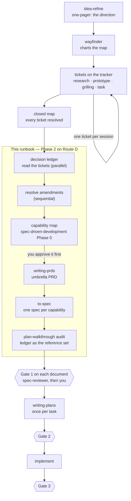

# From a closed wayfinder map to a set of specs

A **runbook**. It serves one route — [Route D](../WORKFLOW.md#route-d--the-multi-session-map) —
and nothing else. If you did not arrive here holding a `wayfinder` map whose tickets are all
closed, you do not need this page.

Every file path named below is defined once, in the
[artifact ledger](../WORKFLOW.md#the-artifact-ledger). This page names artifacts; it does not
restate where they land.

## Contents

- [When this applies](#when-this-applies)
- [How you arrive here](#how-you-arrive-here)
- [Why a closed map is not a spec](#why-a-closed-map-is-not-a-spec)
- [The decision ledger](#the-decision-ledger)
- [Building it: two passes, and only one parallelises](#building-it-two-passes-and-only-one-parallelises)
- [What each skill contributes, and what it does not](#what-each-skill-contributes-and-what-it-does-not)
- [The run order](#the-run-order)
- [What it does to Gate 1 and to Phase 3](#what-it-does-to-gate-1-and-to-phase-3)

---

## When this applies

**Entry condition.** Every ticket on the map is resolved, and the map's *Not yet specified*
section holds only fog you have decided not to chase.

**Exit condition.** One umbrella PRD, one spec per capability, and an audit that ran in both
directions. Phase 3 then starts from the PRD's phases rather than from a fresh breakdown.

## How you arrive here

The runbook starts at the closed map, but the road to it is part of the same method.

**Enter with a direction.** `idea-refine` first (or `interview-me`): it turns a raw idea into
a one-pager with a recommended direction and an explicit *not doing* list. `wayfinder` then
charts the map toward that direction. The one-pager names the destination; the map works out
how to get there.

**The map and its tickets live on the issue tracker** — `Backlog.md` when its MCP is
available, whatever tracker the project uses otherwise. The Phase 3 tasks come back to the
same tracker later, so the whole route reads from one place.

**Each ticket dispatches its skill.** A `research` ticket dispatches `research`; a
`prototype` ticket dispatches `prototype`; a `grilling` ticket — the default type —
dispatches `grilling` and `domain-modeling` together. A `task` ticket dispatches nothing:
the work is manual.

**One ticket per session.** Resolve a ticket, record the resolution as a comment, close it,
update the map's index. Repeat in fresh sessions until the entry condition above holds.

The whole route in one picture, with the part this page covers:

## Why a closed map is not a spec

`wayfinder` ends with a map whose tickets are all resolved. That is a set of decisions, not a
specification, and the gap between the two is wider than it looks, because **you cannot read
the current state of a decision from the decision itself.**

The map's *Decisions so far* is an index — "one line per closed ticket, enough to judge
relevance, then zoom the link for the detail the ticket holds". It is written in closing
order and never rewritten. And when a later decision invalidates an earlier one, wayfinder
updates or deletes *those tickets* — the ones still open. A decision already closed and then
overturned carries no mark of it. To learn what it rules today you have to read every later
entry and look for the amendment.

That is correct behaviour for a map, and a trap for whoever writes the spec from it. It is
the same *stale premise* failure the map catches during exploration: a sentence that still
looks true after the reason for it is gone, and then gets copied somewhere new.

## The decision ledger

One table, one row per decision, built once by reading every resolution:

| Decision | What it rules **now** | Amended or superseded by | Owning capability | Section that houses it | Status |
|---|---|---|---|---|---|
| the closed ticket, by name | one sentence, rewritten only when a later decision changed it | the later decision, by name, or `—` | the module id it belongs to | the one section of the one document | `current`, `amended-by`, `superseded-by`, `out-of-scope`, `open` |

**Four sources feed it, not one.** The closed tickets give the decisions. The map's *Out of
scope* gives the non-goals — without it the document invents its own, and that is how
excluded work finds its way back in. The residue of *Not yet specified* gives the open
questions. The map's *Destination* and *Notes* give the problem and the goal. The ledger is
complete only when all four are in it.

**It does two jobs, and the second is the one that matters most:**

- **Before writing**, it tells each section exactly what to state, and nothing more.
- **After writing**, it audits. Every decision has exactly **one** home. A decision appearing
  in two sections is the same failure again: two copies that will drift, and
  the wrong one survives because it still reads as true.

**The ledger is ephemeral**, like an implementation plan. The map stays canonical and the
ledger is a build artifact, regenerable by re-reading the tickets; it must never become a
second source of truth. What survives of it is two things only: the *Decisions* section of
the document, and the reference set the audit runs against.

## Building it: two passes, and only one parallelises

Do not confuse them.

**Reading the tickets parallelises.** Fan out read-only subagents over batches. Each reports
what a ticket rules and quotes verbatim any sentence that names or contradicts an earlier
one. It interprets nothing — interpretation needs the whole set.

**Resolving the amendment chain does not.** A late decision can only be judged against
everything before it, so that pass is sequential, in one session, walking the rows forward
in closing order.

## What each skill contributes, and what it does not

**The capability map comes from the ledger itself.** Grouping the live rows by area *is* the
decomposition, because the clusters are the modules. `spec-driven-development` Phase 0 then
formalises what the grouping already found — stable kebab-case ids, one-way dependencies, a
build order — and it is gated, so ten lines get reviewed instead of a wrong document.

Its Phase 1 is a different matter, and not for the reason usually given: the objection is not
only that its elicitation would reopen settled questions, it is that its template's sections
are *Commands, Project Structure, Code Style, Boundaries*. That describes a toolchain, not a
decision. Use Phase 0; write the documents with `writing-prds` above and `to-spec` per
capability.

**The audit is already a skill.** `plan-walkthrough` extracts a `REQ-1…n` backbone and a
traceability matrix from the finished document; run it with the ledger as the reference set
and read the matrix in **both** directions. A live ledger row mapping to no `REQ` is a
**forgotten decision**. A `REQ` tracing to no row is an **invented requirement** — a
decision taken quietly while writing. Neither is resolved on the spot: each becomes an entry
in the document's `## To be confirmed`.

**`writing-prds` gates on two inputs, and a closed map satisfies both** rather than waiving
either. The first is a validated understanding of the problem, for which it accepts "a design
doc from `brainstorming`, an evaluated issue, or an equivalent written source". The second is
the decisions from `grilling` — and this is the part usually misread as a missing
prerequisite. It is not missing: `wayfinder` **calls `grilling` itself** — once to name the
destination, again to map the frontier, and always on a `grilling` ticket, which is its
default ticket type. So the decisions the map carries are grilling output by default, not a
step that was skipped. The `writing-prds` review checklist then asks "is every grilling
decision reflected?", which is the ledger's audit stated in the skill's own words.

**Two skills stay out.** `interview-me` finds out what someone wants, and that is settled —
it is also not reachable from `wayfinder`, which dispatches `research`, `prototype`,
`grilling` and `domain-modeling`; a `task` ticket dispatches nothing, and its work is manual.
`consolidate-specs` makes a document agree with the code, and there is no code yet; it
belongs after Phase 4.

## The run order

Seven steps. Only the first parallelises. Each row names the one constraint that is not
obvious from the sections above.

| # | Step | The constraint |
|---|---|---|
| 1 | Read the closed tickets, in batches, with read-only subagents | They interpret nothing. Interpretation is step 2's job, and it needs the whole set. |
| 2 | Walk the rows forward in closing order, filling *what it rules now* and *amended or superseded by* | Sequential, one session. You can only judge a late decision against everything before it. |
| 3 | Add the three non-ticket sources | The ledger is not complete until all four are in it, not just the tickets. |
| 4 | Group the live rows by area, then run `spec-driven-development` Phase 0 on that grouping | Phase 0 only. Its Phase 1 template describes a toolchain, not a decision. |
| 5 | `writing-prds` for the umbrella | Any question it raises that the ledger already answers is answered **from the ledger**, not from you. That is what keeps a settled decision settled. |
| 6 | `to-spec` once per capability, each named by its module id | One ledger row, one document, one section. The count of tasks and the count of specs do not have to match: one spec may draw from several tasks, and a large capability may split into several specs. |
| 7 | `plan-walkthrough` on each finished document, with the ledger as the reference set | Read the matrix in both directions. Neither kind of mismatch is resolved on the spot. |

## What it does to Gate 1 and to Phase 3

**Gate 1 still has two halves.** `writing-prds` stops and asks for approval before it
decomposes anything, and that stop is the **human** half — an approval requested by the
agent that just wrote the document, in the session that wrote it. It is not the whole gate.
Run `spec-reviewer` on the PRD first, then answer the stop having read its findings. You
still approve once; you just read the review before you do.

The three checks on this route look similar and are not interchangeable. `grilling` tested
the **decisions**, ticket by ticket, while the map was open. `spec-reviewer` tests the
**document** against the real codebase. `plan-walkthrough` tests **traceability** between the
ledger and the document's `REQ` backbone. A set of individually sound decisions still
composes into a self-contradictory document, which is the failure the ledger exists to catch.

**Phase 3 shrinks.** The `writing-prds` phases *are* the task breakdown: one task per phase,
into `Backlog.md` when the MCP is there and into a `## Task breakdown` section of the PRD
when it is not. So arriving in Phase 3 from a PRD, `planning-and-task-breakdown` has nothing
left to find — the dependency graph and the vertical slices were decided when the phases
were, and a second derivation is how the two disagree. Phase 3 becomes `writing-plans`, once
per task.
