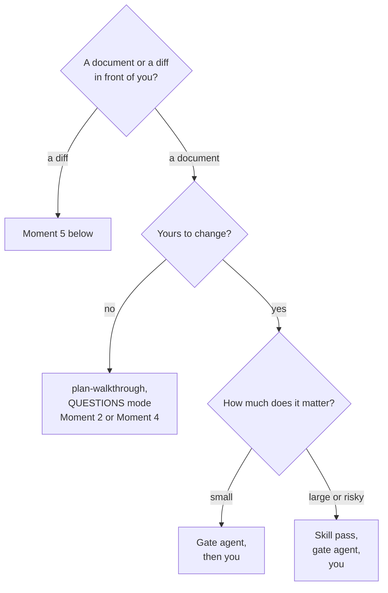
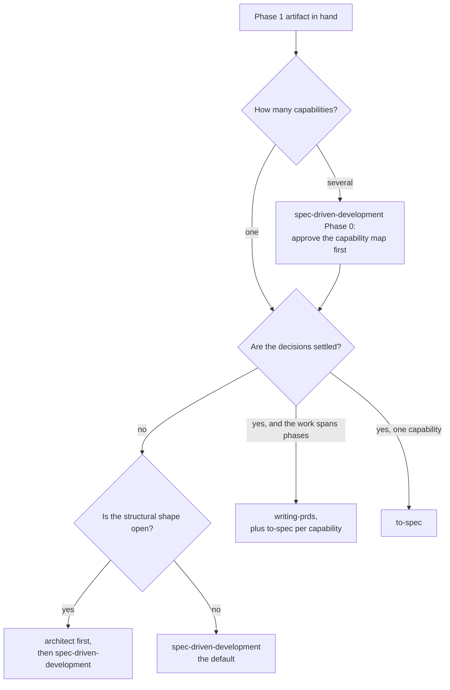

# Writing and reviewing: which helper, at which moment

A **playbook**. It serves the five moments where you choose between a skill, a gate agent,
and your own reading: writing the Phase 2 document, reviewing it, writing the Phase 3 plan,
reviewing it, and reviewing the diff. If you are not inside one of those moments, you do not
need this page.

The document set splits the work like this. [`WORKFLOW.md`](../WORKFLOW.md) is normative —
the phases, the gates, the artifacts. [`TOOLS.md`](TOOLS.md) is the reference — every tool
once, and the rules that decide whether two of them compose. [`MAP-TO-SPEC.md`](MAP-TO-SPEC.md)
is a runbook for one route. This page is the fourth kind, a playbook: it owns the **decision
procedures and the step sequences** for its five moments, and nothing else. Every fact it
uses lives somewhere else, and every section links to that home.

## Contents

- [The pattern: skill, agent, or both](#the-pattern-skill-agent-or-both)
- [The four shapes a Phase 2 document can take](#the-four-shapes-a-phase-2-document-can-take)
- [Moment 1 — writing the Phase 2 document](#moment-1--writing-the-phase-2-document)
- [Moment 2 — reviewing the Phase 2 document](#moment-2--reviewing-the-phase-2-document)
- [Moment 3 — writing the Phase 3 plan](#moment-3--writing-the-phase-3-plan)
- [Moment 4 — reviewing the plan](#moment-4--reviewing-the-plan)
- [Moment 5 — reviewing the diff](#moment-5--reviewing-the-diff)
- [Which picture, from which tool](#which-picture-from-which-tool)
- [What this page does not cover](#what-this-page-does-not-cover)

---

## The pattern: skill, agent, or both

Three kinds of helper can look at your work, and they are not interchangeable:

| Kind | How it works | What it is for |
|---|---|---|
| a **skill** | reviews *with* you. It walks you through its findings, asks you to triage each one, and writes a dossier. In EDIT mode it applies the fixes you accept. | finding and fixing problems while editing is still cheap |
| a **gate agent** | reviews with fresh eyes. A clean context window, the real codebase, blocking findings first, each with a concrete fix. | checking the corrected document against reality |
| **you** | read, judge, decide. | the only one who can say the work was worth doing |

The order when you combine them is fixed, and its home is
[Who reviews what](../WORKFLOW.md#who-reviews-what): **skill first, agent second, you
last.** The skill finds and fixes problems while editing is cheap. The agent then checks the
corrected document against reality. The other order wastes the agent on a document the skill
was about to change.

> **A skill makes the document cheaper to fix. An agent tells you whether it stands.
> Only you can decide it was worth writing.**

One pair sits upstream of every document and is not this page's business: `grilling` and
`interview-me` test the *thinking* before any document exists. Their row is in
[Who reviews what](../WORKFLOW.md#who-reviews-what); their catalogue rows are in
[TOOLS.md → Phase 1](TOOLS.md#phase-1--brainstorm).

The whole choice in one picture:

---

## The four shapes a Phase 2 document can take

Four tools can write the Phase 2 document, and they write three different shapes of it.
[TOOLS.md → Phase 2](TOOLS.md#phase-2--specify) says what each tool does; this table says
which *document* fits which job:

| Shape | Written by | It fits when | It does not fit when |
|---|---|---|---|
| **design doc** | `brainstorming` | one conversation should carry you from idea to draft design | you need a separate stated intent to check the spec against |
| **project-setup spec** — objective, commands, structure, code style, testing, boundaries | `spec-driven-development` | one capability, and the requirements still need an interview | the decisions behind it are already settled |
| **user-story spec** — problem, solution, numbered stories, decisions, testing seams | `to-spec` | one capability, decisions closed, no interview wanted | anything is still open — a synthesis cannot settle an open question |
| **phased PRD** — problem, goal, non-goals, phases with acceptance criteria | `writing-prds` | several phases, decisions settled, work that spans sessions | the input is a raw idea — the skill refuses it |
| **three lines** | you | the change is small — [Route A](../WORKFLOW.md#route-a--the-one-line-change) | everywhere else |

The smallest legal version of every phase is defined once, in
[Route A](../WORKFLOW.md#route-a--the-one-line-change).

> **Pick the shape before you pick the tool. Two tools write a spec; only one of them asks
> you anything.**

The writing choice as a picture:

Arriving from a closed `wayfinder` map is a different job with its own runbook —
[MAP-TO-SPEC.md](MAP-TO-SPEC.md).

---

## Moment 1 — writing the Phase 2 document

**The menu.**

| The situation | Write with | Your part | The cost |
|---|---|---|---|
| a clear intent, one capability | `spec-driven-development` — the default | answer the interview; surface assumptions as they come | one conversation and one document |
| a clear intent, several capabilities | `spec-driven-development` Phase 0 first | approve the capability map before any spec is written | one extra short document, gated |
| an open structural question | `architect`, then `spec-driven-development` | choose between the alternatives `architect` names | one extra pass — and Gate 1 gets cheaper, because the design already carries its rejected alternatives |
| settled decisions, work that spans phases or sessions | `writing-prds`, plus `to-spec` per capability | bring the settled decisions — the skill refuses a raw idea | the highest writing cost of the four |
| settled decisions, one capability | `to-spec` | check the testing seams match what you expected | no interview — so anything still open stays open |
| a small change | you, three lines | read them once as if someone else wrote them | nearly nothing |

**The steps.**

1. Start from the Phase 1 artifact — [the transition: intent to spec](../WORKFLOW.md#the-transition-intent-to-spec)
   says what must cross the boundary, and what gets dropped.
2. Pick the shape from [the table above](#the-four-shapes-a-phase-2-document-can-take), then
   the tool from this menu.
3. Write the document with the tool. Answer its questions from the artifacts, not from
   memory of the conversation.
4. Move to [Moment 2](#moment-2--reviewing-the-phase-2-document).

**The wrong turns.**

- **`writing-prds` from a raw idea.** It refuses — that refusal is the design, not an
  obstacle. The signal: you cannot name the decisions the PRD should carry.
- **`to-spec` with an open decision.** A synthesis cannot settle an open question. The
  signal: an argument you keep having with yourself while reading the draft.
- **`brainstorming` when Gate 1 needs a measure.** Spec and intent arrive together, so there
  is nothing to check the spec against — see the
  [three ways the transition happens](../WORKFLOW.md#the-transition-intent-to-spec).

---

## Moment 2 — reviewing the Phase 2 document

**The menu.**

| The situation | Review with | Your part | The cost |
|---|---|---|---|
| the document is short and routine | no skill pass — you read it, then the gate | read it as if someone else wrote it | minutes |
| the document is long, or you want a structured check before the gate | `plan-walkthrough`, EDIT mode | answer the closed questions; triage each finding | a walkthrough session; the dossier records every fix |
| the document is not yours — an external spec, an issue, a document from the web | `plan-walkthrough`, QUESTIONS mode | turn findings into author questions; approve the exact comment text before anything is posted | a walkthrough session; findings land as questions, not fixes |
| whenever a real document was written | `spec-reviewer` — the agent half of [Gate 1](../WORKFLOW.md#gate-1) | read the findings, then approve or send back | one fresh-context pass |

**EDIT or QUESTIONS?** The skill asks at setup; the choice is yours:

| | EDIT | QUESTIONS |
|---|---|---|
| the document is | yours to change | someone else's |
| findings become | applied corrections, each shown as a before/after you approve | author questions, optionally a drafted comment for the source |
| a clean run ends with | a verdict menu — *ready to commit* hands off to `writing-prds` task decomposition | the question list, phrased as questions |

What each mode does is in the [`plan-walkthrough` row](TOOLS.md#phase-3--plan).

**The steps** — the both path; the others are its prefixes:

1. Run `plan-walkthrough` on the finished document, and choose the mode.
2. Triage every finding; in EDIT mode, approve each fix as a before/after.
3. Run [Gate 1](../WORKFLOW.md#gate-1): `spec-reviewer` reads the corrected document against
   the real codebase.
4. Read the findings and approve — or send the document back.

**The wrong turns.**

- **The agent before the skill.** You spend fresh eyes on problems a walkthrough would have
  fixed for less. The signal: the agent's report is mostly typos and broken structure.
- **The skill instead of the gate.** A walkthrough is not a gate; nothing has checked the
  corrected document against reality until `spec-reviewer` has. The signal: you approved
  because the dossier looks tidy.
- **QUESTIONS mode on your own document.** Findings become questions for an author who is
  you. The signal: you are drafting a comment to yourself.

---

## Moment 3 — writing the Phase 3 plan

This moment is short on purpose. The four ways to break work into a plan already have a
home: [the transition: spec to plan](../WORKFLOW.md#the-transition-spec-to-plan). This
section does not restate them.

**The menu.**

| The situation | Write with | Your part | The cost |
|---|---|---|---|
| a spec, and you can already name step one | `writing-plans` directly | check the plan stays inside the spec's scope | one document |
| a spec, and you cannot name step one | `planning-and-task-breakdown` first, then `writing-plans` | confirm the dependency order | one extra document — the breakdown |
| a PRD from `writing-prds` | `writing-plans` once per task — **no breakdown pass** | keep one plan per task | the cheapest Phase 3 of any route |
| a small change | you — the list of files you are about to touch | keep the list honest | nearly nothing |

**The steps.**

1. Take the breakdown path from
   [the transition table](../WORKFLOW.md#the-transition-spec-to-plan). The signal is whether
   you can name step one — not the size of the change.
2. Write the plan. Its required executor is named by `writing-plans` itself — see the
   [catalogue row](TOOLS.md#phase-3--plan).
3. Move to [Moment 4](#moment-4--reviewing-the-plan).

**The wrong turns.**

- **A second derivation of the dependency graph.** The graph was settled in Phase 2; a
  second pass will disagree with the first, and nothing tells you which one counts. The
  signal: you are running a breakdown "to be sure".
- **Splitting a plan to make plans line up.** Split only when `writing-plans` says the spec
  spans several subsystems.

---

## Moment 4 — reviewing the plan

**The menu.**

| The situation | Review with | Your part | The cost |
|---|---|---|---|
| the plan is short and routine | no skill pass — you read it, then the gate | read it as if you will execute it cold | minutes |
| the plan is long, or it arrived from outside this pipeline | `plan-walkthrough` — QUESTIONS mode when it is not yours | triage the findings | a walkthrough session |
| whenever a plan was written | `implementation-plan-reviewer` — the agent half of [Gate 2](../WORKFLOW.md#gate-2) | read the findings, then approve or send back | one fresh-context pass |
| Route D: the ledger audit | `plan-walkthrough`, with the decision ledger as its reference set | read the traceability matrix in both directions | step 7 of the runbook — [MAP-TO-SPEC.md](MAP-TO-SPEC.md) |

**The steps.**

1. Run `plan-walkthrough` when the plan is long or external; skip it for short routine plans.
2. Run [Gate 2](../WORKFLOW.md#gate-2): `implementation-plan-reviewer` opens every file the
   plan names — the one check no other reviewer makes.
3. Read the findings and approve — or send the plan back.

**The wrong turns.**

- **Skipping the gate because the walkthrough felt thorough.** A walkthrough is not a gate.
  The signal: you approved a plan with no fresh-context check since the session that wrote
  it.
- **Pushing harder at Phase 3 when the plan will not sequence.** The design underneath it is
  wrong; the move is back to Phase 2. The signal: every ordering you try breaks something.

---

## Moment 5 — reviewing the diff

One rule sorts the whole menu:

> **A feeding skill runs before its gate. A cleanup skill runs after it.**

`code-review-and-quality`, `pr-walkthrough` and `/adversarial-code-review` are feeding
skills: they find problems, and the gate consumes what they found. `ponytail-review` and
`code-simplification` are cleanup skills: they run on code the gate has already accepted —
simplifying code that is still wrong produces elegant wrong code. The orderings live in
[TOOLS.md](TOOLS.md#the-orderings-still-worth-naming).

**The menu.**

| The situation | Review with | Your part | The cost |
|---|---|---|---|
| most work | `code-reviewer` alone — the gate | read the findings; fix or explicitly accept each one | one pass — the default |
| a broad look before the gate | `code-review-and-quality`, then `code-reviewer` | triage the themes it finds | two passes |
| the diff is large, unfamiliar, or someone else's PR | `pr-walkthrough` first — the logical pass above the code — then the code level | judge the impact map before the lines; consume the parked list | a walkthrough session, plus the code level |
| merge-bound and risky | `/adversarial-code-review` | read the verified verdict, then merge explicitly | the heaviest option |
| the diff is correct but inflated | `ponytail-review`, then `code-simplification` — after the gate | decide which cuts you accept | small, and it pays in lines removed |

**The three step sequences.**

1. **The default run:** `code-reviewer` → you. For most work this is enough.
2. **The broad run:** `code-review-and-quality` → `code-reviewer` → you.
3. **The heavy run:** `pr-walkthrough` → `/adversarial-code-review` → `code-reviewer` →
   you.

Within the code level, keep one order: **correctness first, clarity second, security
wherever it applies.**

> **Stacking reviewers is a symptom, not a remedy.** The cure for a thin review is a thicker
> earlier gate — [`WORKFLOW.md`](../WORKFLOW.md#phase-5--review) says so in its own words.

**The wrong turns.**

- **A feeding skill after its gate.** The gate has already narrowed the field, so the broad
  pass finds what is left, not what matters. The signal: the skill's report mostly repeats
  the gate's findings.
- **Cleanup before correctness.** `code-simplification` on code that is still wrong produces
  elegant wrong code. The signal: you are refactoring while findings are still open.
- **Security first touched at review time.** `security-and-hardening` belongs in Phase 4,
  while the sensitive code is written; Phase 5 adds only a dedicated pass over the sensitive
  surfaces. The signal: untrusted input was handled, and no pass ever ran.

---

## Which picture, from which tool

You need a picture of something; each tool draws one kind:

| You need a picture of… | The tool | The picture |
|---|---|---|
| the route to a distant destination | `wayfinder` | the map on the issue tracker |
| the design of a system that is not built yet | `architect`, or a `prototype` | a written design, or something concrete to react to |
| a document's own structure | `plan-walkthrough` | the dossier: phase graph, traceability matrix, assumption map — the document, [not the architecture](../WORKFLOW.md#who-reviews-what) |
| the architecture a change touches | `pr-walkthrough` | before-and-after diagram of the touched part, plus the impact map |
| the shape of the whole codebase | `/improve-codebase-architecture` | the HTML report |

## What this page does not cover

- Phase 1 tools and how they combine — [TOOLS.md → Phase 1](TOOLS.md#phase-1--brainstorm).
- Execution contexts — [`WORKFLOW.md` → Phase 4](../WORKFLOW.md#phase-4--implement).
- Route D end to end — [MAP-TO-SPEC.md](MAP-TO-SPEC.md).
- What each gate agent checks, axis by axis — [agents/README.md](../agents/README.md#the-three-reviewers).
- Where each skill comes from — [skills/README.md](../skills/README.md).
